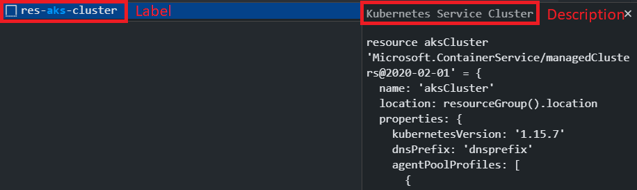

# Contributing to Bicep

We are very happy to accept community contributions to Bicep, whether those are [Pull Requests](#pull-requests), [Example Files](#example-files), [Feature Suggestions](#feature-suggestions) or [Bug Reports](#bug-reports)! Please note that by participating in this project, you agree to abide by the [Code of Conduct](./CODE_OF_CONDUCT.md), as well as the terms of the [CLA](#cla).

## Getting Started

* If you haven't already, you will need [dotnet](https://dotnet.microsoft.com/download) core sdk 5.0.100 and [node + npm](https://nodejs.org/en/download/) 10 (or later) installed locally to build and run this project.
* You are free to work on Bicep on any platform using any editor, but you may find it quickest to get started using [VSCode](https://code.visualstudio.com/Download) with the [C# extension](https://marketplace.visualstudio.com/items?itemName=ms-dotnettools.csharp).
* Fork this repo (see [this forking guide](https://guides.github.com/activities/forking/) for more information).
* Checkout the repo locally with `git clone git@github.com:{your_username}/bicep.git`.
* If `git status` shows untracked files in the `bicep-types-az` directory, remove the directory via `rm -r bicep-types-az` on Linux/Mac or `rmdir /S bicep-types-az` on Windows. (This is only needed once.)
* Build the .NET solution with `dotnet build`.

## Developing

### Components

The Bicep solution is comprised of the following main components:

* **Bicep CLI** (`src/Bicep.Cli`): the `bicep` CLI executable.
* **Bicep Language Server** (`src/Bicep.LangServer`): the LanguageServer used by the VSCode extension for parsing and providing information about a Bicep file.
* **Bicep Core** (`src/Bicep.Core`): the library containing the majority of the Bicep compiler code.
* **Bicep VSCode Extension** (`src/vscode-bicep`): the VSCode extension itself. This is mostly a thin wrapper around the Bicep Language Server.
* **Playground** (`src/playground`): the web-based playground hosted at `https://aka.ms/bicepdemo`.
* A number of different test suites.

### Running the tests

* You can use the following command to run the full Bicep test suite:
  * `dotnet test`

### Updating test baselines

Many of the bicep integration tests rely on baseline test assertion files that are checked into the repo. Code changes in some areas will require updates to the baseline assertions.

#### Manually

* If you see a test failure with a message containing Windows and *nix copy commands, you have encountered such a test. You have the following options to fix the test:
  1. Manually execute the provided command in a shell. This makes sense for a single test, but is extremely tedious otherwise.
  1. Run [`./scripts/SetBaseline.ps1`](./scripts/SetBaseline.ps1) (Windows) or [`./scripts/SetBaseline.sh`](./scripts/SetBaseline.sh) (Linux/OSX) to execute the tests in `SetBaseLine` mode. This automatically updates the baselines in bulk for failing tests.
  1. You should see baseline file modifications in Git pending changes. (Make sure your Git pending changes are empty before doing so - your changes could get overwritten!).
* Inspect the baseline assertion diffs to ensure changes are expected and match the code changes you have made. (If a pull request contains changes to baseline files that can't be explained, it will not be merged.)

#### Via GitHub Action

If you have an active branch pushed to your GitHub fork, you can use the "Update Baselines" GitHub action to automatically update any broken baselines:

1. Under your fork of the repo, navigate to "Actions" -> "Update Baselines".
1. Press "Run workflow", and select your branch name under the "Use work flow from" dropdown.
1. If any baseline changes are detected, the action will create a commit with the diffs, and push it to your branch.
1. Because of [this limitation](https://docs.github.com/en/actions/reference/events-that-trigger-workflows#triggering-new-workflows-using-a-personal-access-token), you will need to manually re-run the CI action once the commit has been made:
    1. Under your fork of the repo, navigate to "Actions" -> "Build".
    1. Press "Run workflow", and select your branch name under the "Use workflow from" dropdown.

### Creating new integration tests dataset

* To Add new integration tests dataset you need to:
  1. Add an entry to `src/Bicep.Core.Samples/DataSets.cs`
     * prefix with Invalid if the expectation is that it doesn't compile.
     * The suffix should match the type of newline the file uses, so just pick one (_LF or _CRLF) - that's just to ensure we have support for both.
     * The name of the entry should match the name of the folder you create (same casing), and there should be a main.bicep file in that folder.
  1. Make changes to main.bicep.
  1. Create empty `main.<suffix>.bicep` assertion files in the folder. You need to create following suffixes: `diagnostics`, `formatted`, `symbols`, `syntax`, `tokens`
  1. Follow [Updating test baselines](#updating-test-baselines) to generate baseline files.
* The naming and file structure is important here as it's used by the test runner to assert e.g. whether the example should compile, and the end-of-line characters.
* For tests that deal with module, you may see some unexpected behavior because the test could be using a mock file resolver instead of the standard one. Similarly, some tests may be using a mock resource type provider instead of the standard ones - usually that explains why some types aren't recognized in tests.

### Running the Bicep VSCode extension

* On the first run, you'll need to ensure you have installed all the npm packages required by the Bicep VSCode extension with the following:
  * `cd src/vscode-bicep`
  * `npm i`
* In the [VSCode Run View](https://code.visualstudio.com/Docs/editor/debugging), select the "Bicep VSCode Extension" task, and press the "Start" button. This will launch a new VSCode window with the Bicep extension and LanguageServer containing your changes. When running on WSL, create a symbolic link in `src/vscode-bicep` named `bicepLanguageServer` to `../Bicep.LangServer/bin/Debug/net6.0`.
* If you want the ability to put breakpoints and step through the C# code, you can also use the "Attach" run configuration once the extension host has launched, and select the Bicep LanguageServer process by searching for "bicep".

### Running the Bicep CLI

* In the [VSCode Run View](https://code.visualstudio.com/Docs/editor/debugging), select the "Bicep CLI" task, and press the "Start" button. This will build and run the Bicep CLI and allow you to step through the code.
* Note that usually you will want to pass your own custom arguments to the Bicep CLI. This can be done by modifying the `launch.json` configuration to add arguments to the "args" array for the "Bicep CLI" task. 

### Running the Playground

* On the first run, you'll need to ensure you have installed all the npm packages required by the Bicep Playground with the following:
  * `cd src/playground`
  * `npm i`
* In the [VSCode Run View](https://code.visualstudio.com/Docs/editor/debugging), select the "Bicep Playground" task, and press the "Start" button. This will launch a browser window with the Playground containing your changes.

## Pull Requests

If you'd like to start contributing to Bicep, you can search for issues tagged as "good first issue" [here](https://github.com/Azure/bicep/labels/good%20first%20issue).

### Bicep Code

* Ensure that an issue has been created to track the feature enhancement or bug that is being fixed.
* In the PR description, make sure you've included "Fixes #{issue_number}" e.g. "Fixes #242" so that GitHub knows to link it to an issue.
* To avoid multiple contributors working on the same issue, please add a comment to the issue to let us know you plan to work on it.
* If a significant amount of design is required, please include a proposal in the issue and wait for approval before working on code. If there's anything you're not sure about, please feel free to discuss this in the issue. We'd much rather all be on the same page at the start, so that there's less chance that drastic changes will be needed when your pull request is reviewed.
* We report on code coverage; please ensure any new code you add is sufficiently covered by tests.

### Example Files

We are integrating the Bicep examples into the [Azure QuickStart Templates](https://github.com/Azure/azure-quickstart-templates/blob/master/1-CONTRIBUTION-GUIDE/README.md).  If you'd like to contribute new example `.bicep` files that showcase abilities of the language, please follow [these instructions](https://github.com/Azure/azure-quickstart-templates/blob/master/1-CONTRIBUTION-GUIDE/README.md) to add them directly there.  We can still take bug reports and fixes for the existing examples for the time being.

### Snippets

If you'd like to contribute to the collection of snippets:  

* A snippet should either be a single, generic resource or follow [parent-child syntax](https://docs.microsoft.com/azure/azure-resource-manager/bicep/child-resource-name-type). Ensure your snippet meets this criteria.
* Add a Bicep file to [`./src/Bicep.LangServer/Snippets/Templates`](./src/Bicep.LangServer/Snippets/Templates) using the naming convention res-RESOURCENAME.bicep
  * The file name without extension will be used as the label.
  * A single line comment at the top of the file will be used as the description.
  * E.g. [`res-aks-cluster.bicep`](./src/Bicep.LangServer/Snippets/Templates/res-aks-cluster.bicep) results in the following label and description:
 
  * Add the Bicep resource declaration.
  * Add placeholders for tab stops. Placeholders must be enclosed within comment and followed by default text e.g. `/*${1:foo}*/foo`. The placeholder text will be inserted and selected such that it can be easily changed. The symbolic name should be the first tab stop.
  * To add a multi-choice placeholder, the syntax is a comma separated enumeration of values, enclosed with the pipe-character, for example `${1|one,two,three|}`. When the snippet is inserted and the placeholder selected, choices will prompt the user to pick one of the values. [More info on snippet syntax](https://microsoft.github.io/language-server-protocol/specifications/specification-current/#snippet_syntax)
  * Property placeholder values should correspond to their property names (e.g. dnsPrefix: 'dnsPrefix'), unless it's a property that MUST be changed or parameterized in order to deploy. In that case, use 'REQUIRED' e.g. [keyData](./src/Bicep.LangServer/Snippets/Templates/res-aks-cluster.bicep#L26)
  * Snippet with parent-child syntax, should have parent resource declared first. Do not add placeholder for parent resource symbolic name.
* Add a new folder in the following directory, for an integration test that validates snippet completion: [`./src/Bicep.LangServer.IntegrationTests/Completions/SnippetTemplates`](./src/Bicep.LangServer.IntegrationTests/Completions/SnippetTemplates)
  * The folder name should match the snippet label/prefix.

* Add a file named main.bicep
  * The test will read this input file for snippet completions. It will take the replacement values listed in this file, replace them with their corresponding placeholder, then ensure Bicep reports no warnings or errors.
    * E.g. [`res-aks-cluster/main.bicep`](./src/Bicep.LangServer.IntegrationTests/Completions/SnippetTemplates/res-aks-cluster/main.bicep)

* Add a file named main.combined.bicep that contains the template combined with placeholder values. See [Updating test baselines](#updating-test-baselines) for information on how to automatically generate this file to match the format expected by the tests.
  * E.g. [`res-aks-cluster/main.combined.bicep`](./src/Bicep.LangServer.IntegrationTests/Completions/SnippetTemplates/res-aks-cluster/main.combined.bicep)

* See [Running the tests](#running-the-tests) if you'd like to test locally before submitting a PR.

* Submit a PR for review

## Feature Suggestions

* Please first search [Open Bicep Issues](https://github.com/Azure/bicep/issues) before opening an issue to check whether your feature has already been suggested. If it has, feel free to add your own comments to the existing issue.
* Ensure you have included a "What?" - what your feature entails, being as specific as possible, and giving mocked-up syntax examples where possible.
* Ensure you have included a "Why?" - what the benefit of including this feature will be.
* Use the "Feature Request" issue template [here](https://github.com/Azure/bicep/issues/new/choose) to submit your request.

## Bug Reports

* Please first search [Open Bicep Issues](https://github.com/Azure/bicep/issues) before opening an issue, to see if it has already been reported.
* Try to be as specific as possible, including the version of the Bicep CLI or extension used to reproduce the issue, and any example files or snippets of Bicep code needed to reproduce it.
* Use the "Bug Report" issue template [here](https://github.com/Azure/bicep/issues/new/choose) to submit your request.

## CLA

This project welcomes contributions and suggestions.  Most contributions require you to agree to a
Contributor License Agreement (CLA) declaring that you have the right to, and actually do, grant us
the rights to use your contribution. For details, visit https://cla.opensource.microsoft.com.

When you submit a pull request, a CLA bot will automatically determine whether you need to provide
a CLA and decorate the PR appropriately (e.g., status check, comment). Simply follow the instructions
provided by the bot. You will only need to do this once across all repos using our CLA.

This project has adopted the [Microsoft Open Source Code of Conduct](https://opensource.microsoft.com/codeofconduct/).
For more information see the [Code of Conduct FAQ](https://opensource.microsoft.com/codeofconduct/faq/) or
contact [opencode@microsoft.com](mailto:opencode@microsoft.com) with any additional questions or comments.
