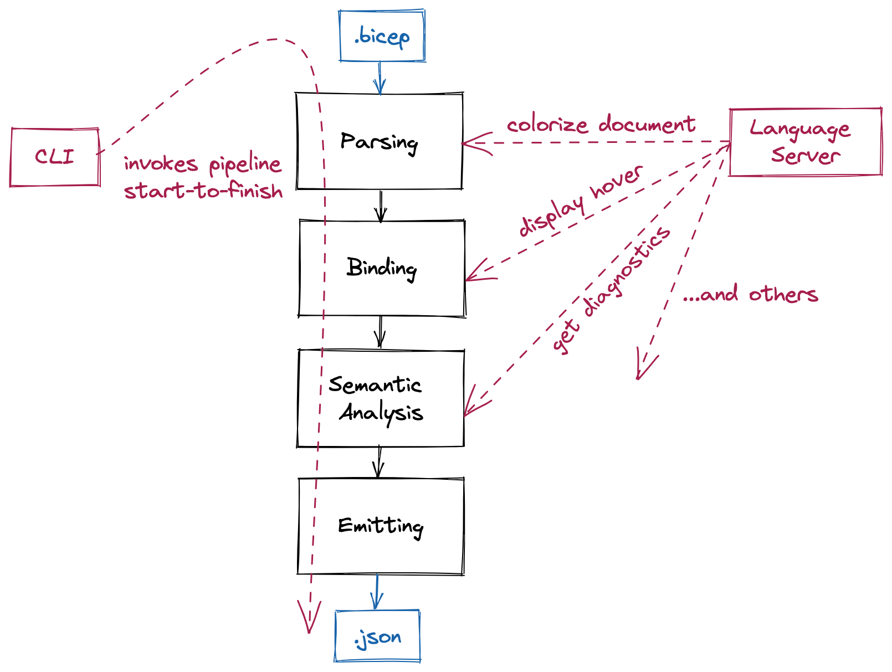

# Codebase Overview
This document provides an overview of the Bicep compiler code structure, and design considerations.

## Compiler Structure

<!-- use excalidraw.com to modify this diagram -->

### Parser
The parser is responsible for converting a stream of text into an in-memory Bicep syntax tree. This is broken down into two stages: lexing and parsing. The lexer ([Lexer.cs](../src/Bicep.Core/Parsing/Lexer.cs)) is responsible from tokenizing a stream of text into distinct tokens. The parser ([Parser.cs](../src/Bicep.Core/Parsing/Parser.cs)) is responsible for taking the tokens generated by the lexer, and building a hierarchical syntax tree from them. Bicep uses a handwritten recursive-descent parsing mechanism to build its syntax trees.

Much of the complexity in the parser comes from the error recovery logic. See [Error Recovery](#error-recovery) for some more information on why this is important.

### Binder
The parser provides a syntax tree of a document, but is not able to understand the semantics of the document. The binder ([Binder.cs](../src/Bicep.Core/Semantics/Binder.cs)) provides the first step of being able to understand the semantics - being able to associate named identifiers (symbols) in the syntax trees with what they are referring to. To do this, it builds a symbol table; a dictionary to be able to efficiently find the symbol which a given piece of syntax is referring to.

### Semantic Analysis
After binding is complete, Bicep uses the semantic model ([SemanticModel.cs](../src/Bicep.Core/Semantics/SemanticModel.cs)) to answer deeper semantic queries about the document.

#### Type Checking
The type manager ([TypeManager.cs](../src/TypeSystem/TypeManager.cs)) is able to answer queries about the type of a particular node in the syntax tree. While performing this type analysis, it also checks for any invalid type assignments using the type assignment visitor [TypeAssignmentVisitor.cs](../src/Bicep.Core/TypeSystem/TypeAssignmentVisitor.cs), and collects type assignment errors or warnings that will eventually be displayed to the user.

#### Linters
Bicep has a built-in linting framework, allowing Bicep's semantic analysis checks to be extended with more specific 'best practice' or code style checks. Linters configuration can be customized by the Bicep configuration file. All linter rules extend a common base class - [LinterRuleBase.cs](../src/Bicep.Core/Analyzers/Linter/LinterRuleBase.cs), and will raise diagnostics if they detect any of the specific patterns they are looking for.

#### Other Analysis
Bicep also performs additional ad-hoc analysis in the emit limitation calculator [EmitLimitationCalculator.cs](../src/Bicep.Core/Emit/EmitLimitationCalculator.cs). This allows for raising diagnostics about and blocking code patterns which we know will result in an invalid template, or have service-side limitations against them.

### Emitter
The template emitter [TemplateEmitter.cs](../src/Bicep.Core/Emit/TemplateEmitter.cs) collects all of the information provided by the previous stages of the pipeline, and uses it to generate an ARM JSON Template, which can then be submitted to the Azure Deployments service. If any error diagnostic has been raised by a previous stage in the pipeline, then emitting a template will be blocked, as it will be unable to accurately generate a semantically valid JSON Template.

### Compilation
The `Compilation` class ([Compilation.cs](../src/Bicep.Core/Semantics/Compilation.cs)) encapsulates all of the necessary information about a Bicep file and related files in order to generate into an ARM template, obtain diagnostics, or answer semantic queries from the language server.

## Project Structure
### Bicep.Core
The [Bicep.Core](../src/Bicep.Core) project is the library that implements all of the compiler pipeline functionality mentioned in the previous section and is used by many projects in our repository.

### Bicep.Cli
The [Bicep.Cli](../src/Bicep.Cli) project implements the Bicep CLI tool that provides the ability to execute commands such as `bicep build` or `bicep decompile`. The entry point is [Program.cs](../src/Bicep.Cli/Program.cs). Official releases publish this project as a self-contained, trimmed, single-file application.

### Bicep.LangServer
The [Bicep.LangServer](../src/Bicep.LangServer) project is an implementation of the [Language Server Protocol (LSP)](https://microsoft.github.io/language-server-protocol/) server which provides support features like goto definition and autocomplete for the Bicep language. The language server program [Program.cs](../src/Bicep.LangServer/Program.cs) starts when the Bicep VSCode extension is being activated. It defines a set of handlers which are used to handle different notifications and requests sent from the Bicep VSCode extension. The implementation is based on the [OmniSharp C# Language Server Protocol](https://github.com/OmniSharp/csharp-language-server-protocol) library. For more details about the language server handlers, refer to the [Language Server Structure](#language-server-structure) section.

### VSCode Extension
The VSCode extension source code is inside the [vscode-bicep](../src/vscode-bicep) folder.

The core of the VSCode extension is a language client ([client.ts](../src/vscode-bicep/src/language/client.ts)). When the VSCode extension is activated, the Bicep language server is launched as a separate process, and the language client established a connection with the language server. The language client communicates with the language server using LSP over JSON-RPC. It notifies the language server when the user makes edits to a Bicep file or executes a command, such as "Go to Definition". The language server compiles the Bicep file and queries the compilation to get diagnostics or answers to semantic questions, which are then returned to the client.

The VSCode extension also consists of a [visualizer](../src/vscode-bicep/src/visualizer) which can show a resource dependency graph for a Bicep file. The visualizer is an React app hosted in a [VSCode webview](https://code.visualstudio.com/api/extension-guides/webview). When the visualizer is opened, it queries the the Bicep language server via the language client to get the resource dependency graph data to be rendered in the visualizer webview.

### Peripherals
#### Decompiler
Provides the ability to generate a Bicep representation of an ARM JSON template, using a heuristic-based approach. [TemplateDecompiler.cs](../src/Bicep.Decompiler/TemplateDecompiler.cs) is the entry-point to this logic.

### Syntax highlighting libraries
We also maintain basic highlighting support for some 3rd party syntax highlighting libraries; [HighlightJs](../src/highlightjs/src/bicep.ts), [Monarch](../src/monarch/src/bicep.ts) and [TextMate](../src/textmate/src/bicep.ts). We use these libraries to power web-based highlighting experiences when the full compiler code is not available - for example GitHub's and Azure DevOps's `.bicep` file highlighting capabilities.

### Azure type generation
This lives in the [bicep-types-az](https://github.com/Azure/bicep-types-az) repository, and is responsible for ingesting Azure API swagger specifications, and generating the [Azure.Bicep.Types.Az](https://www.nuget.org/packages/Azure.Bicep.Types.Az) package which is bundled with Bicep, and provides Bicep with all of the information about resource types available on Azure.

## Language Server Structure
The Bicep language server contains the following handlers located in the [Handlers](../src/Bicep.LangServer/Handlers) folder:
| Name | Description |
| :--- | :---------- |
| [`BicepBuildCommandHandler`](../src/Bicep.LangServer/Handlers/BicepBuildCommandHandler.cs) | Handles the `build` custom LSP request sent from the language client when the user execute the "Build" custom command for a Bicep file in VS Code. When processing the request, the handler invokes the Bicep compiler to compile the Bicep file and emit an ARM template for the Bicep file. |
| [`BicepCodeActionHandler`](../src/Bicep.LangServer/Handlers/BicepCodeActionHandler.cs) | Handles the [Code Action](https://microsoft.github.io/language-server-protocol/specifications/specification-current/#textDocument_codeAction) request. In VS Code, an available Code Action is indicated by a lightbulb near the source code when the cursor is hovered on a squiggle or selected text region. The current available code actions for the Bicep language include code fixes to either fix misspelled symbols and property names or to disable linter rules inline. The former is done by calling the [`SpellChecker.GetSpellingSuggestion`](../src/Bicep.Core/Text/SpellChecker.cs) utility method to check symbol and property names in the semantic analysis and type checking steps when compiling a Bicep file. For implementation details about how linter rules are disabled, see the source code of the handler.  |
| [`BicepCompletionHandler`](../src/Bicep.LangServer/Handlers/BicepCompletionHandler.cs) | Handles the [Completion](https://microsoft.github.io/language-server-protocol/specifications/specification-current/#textDocument_completion) request. The request is sent by the language client to compute completion items at a given cursor position when the user press `Ctrl+Space` or type a trigger character (such as the dot character after a symbol reference). The key of computing completion items is to find the corresponding syntax tree node at the cursor position and use the combination of the the syntax tree node and the cursor position to determine what completion items can be provided. The logic is encapsulated in the [BicepCompletionProvider](../src/Bicep.LangServer/Completions/BicepCompletionProvider.cs) class. |
| [`BicepDefinitionHandler`](../src/Bicep.LangServer/Handlers/BicepDefinitionHandler.cs) | Handles the [Goto Definition](https://microsoft.github.io/language-server-protocol/specifications/specification-current/#textDocument_definition) request sent by the language client to resolve the definition location of a symbol at a given Bicep file position. This is done by compiling the Bicep file to build a symbol table and calling the `ResolveSymbol` method defined on the [`BicepSymbolResolver`](../src/Bicep.LangServer/Providers/BicepSymbolProvider) class. |
| [`BicepDeploymentGraphHandler`](../src/Bicep.LangServer/Handlers/BicepDeploymentGraphHandler.cs) | Handles the `textDocument/deploymentGraph` custom LSP request sent by the Bicep VSCode extension when the user runs the "Open Visualizer" or "Open Visualizer to Side" command. The handler builds a resource deployment dependency graph by using the resource dependency information provided by [`ResourceDependencyVisitor`](../src/Bicep.Core/Emit/ResourceDependencyVisitor.cs) (which is also used to generate `dependsOn` when emitting ARM templates). Once the graph is returned to the Bicep VSCode extension, a webview will be opened to render the graph. |
| [`BicepDidChangeWatchedFilesHandler`](../src/Bicep.LangServer/Handlers/BicepDidChangeWatchedFilesHandler.cs) | Handles the [`DidChangeWatchedFiles`](https://microsoft.github.io/language-server-protocol/specifications/specification-current/#workspace_didChangeWatchedFiles) notification sent from the language client when the client detects changes to files and folders watched by the handler. The watched files include Bicep files, Bicep configuration files, and ARM template files. When invoked, the handler refreshes compilation of all source files in the workspace to make sure the language server is in sync with the language client. |
| [`BicepDocumentFormattingHandler`](../src/Bicep.LangServer/Handlers/BicepDocumentFormattingHandler.cs) | Handles the [Document Formatting](https://microsoft.github.io/language-server-protocol/specifications/specification-current/#textDocument_formatting) request. Upon execution, it calls the `PrintProgram` method defined on the [`PrettyPrinter`] class which invokes [`DocumentBuildVisitor`](../src/Bicep.Core/PrettyPrint/DocumentBuildVisitor) to walk the syntax tree of the given Bicep file and outputs a formatted string for that syntax tree based on a set of formatting rules defined for each syntax tree node type. |
| [`BicepDocumentHighlightHandler`](../src/Bicep.LangServer/Handlers/BicepDocumentHighlightHandler.cs) | Handles the [Document Highlight](https://microsoft.github.io/language-server-protocol/specifications/specification-current/#textDocument_formatting) request. This highlights all references to the symbol where the cursor is placed in a Bicep file. The handler first calls the `ResolveSymbol` method of an [`BicepSymbolResolver`](../src/Bicep.LangServer/Providers/BicepSymbolResolver.cs) instance to find the symbol at the give file position. The references are then found by calling the `FindReferences` method defined on the [`SemanticModel`](../src/Bicep.Core/Semantics/SemanticModel.cs) class. They are further converted to a collection of [DocumentHighlight](https://microsoft.github.io/language-server-protocol/specifications/specification-3-17/#documentHighlight) and returned to the client. |
| [`BicepDocumentSymbolHandler`](../src/Bicep.LangServer/Handlers/BicepDocumentSymbolHandler.cs) | Handles the [Document Symbol](https://microsoft.github.io/language-server-protocol/specifications/specification-current/#textDocument_documentSymbol) request. The returned result is a list of [`DocumentSymbol`](https://microsoft.github.io/language-server-protocol/specifications/specification-3-17/#documentSymbol) scoped to a Bicep file. The handler queries the semantic model of the Bicep file to get all declarations and then converts the symbolic name of each declaration to a `DocumentSymbol`. |
| [`BicepHoverHandler`](../src/Bicep.LangServer/Handlers/BicepHoverHandler.cs) | Handles the [Hover](https://microsoft.github.io/language-server-protocol/specifications/specification-3-17/#textDocument_hover) request. It is sent from the language client to the server to request hover information of a symbol at a given Bicep file position. Typical hover information includes parameter descriptions, variable type information, etc. The handler uses [`BicepSymbolResolver`](../src/Bicep.LangServer/Providers/BicepSymbolProvider) to get the symbol at the requested position and generate the corresponding hover information based on the symbol type. |
| [`BicepReferencesHandler`](../src/Bicep.LangServer/Handlers/BicepReferencesHandler.cs) | Handles the [Find References](https://microsoft.github.io/language-server-protocol/specifications/specification-3-17/#textDocument_references) request. The references request is sent from the client to the server to resolve workspace-wide references for the symbol denoted by the given Bicep file position. Similar to `BicepDocumentHighlightHandler`, `BicepReferencesHandler` queries the semantic model to resolve all references of the symbol found at the given file position. |
| [`BicepRegistryCacheRequestHandler`](../src/Bicep.LangServer/Handlers/BicepRegistryCacheRequestHandler.cs) | Handles the `textDocument/bicepCache` custom LSP request. The request is sent by the client to resolve contents of document URIs using the bicep-cache:// scheme. The `BicepDefinitionHandler` returns such URIs when the user execute the "Goto Definition" command and the definition is inside a module that resides in the local module cache. |
| [`BicepRenameHandler`](../src/Bicep.LangServer/Handlers/BicepRenameHandler.cs) | Handles the [Rename](https://microsoft.github.io/language-server-protocol/specifications/specification-3-17/#textDocument_rename) request. The rename request is sent from the client to the server to ask the server to compute a workspace change so that the client can perform a workspace-wide rename of a symbol. This is done by querying the semantic model to find all references of a resolved symbol and returning a collection of [TextEdit](https://microsoft.github.io/language-server-protocol/specifications/specification-3-17/#textEdit) to be applied to the text ranges of the references on the client side. |
| [`BicepSemanticTokensHandler`](../src/Bicep.LangServer/Handlers/BicepSemanticTokensHandler.cs) | Handles the [Semantic Tokens](https://microsoft.github.io/language-server-protocol/specifications/specification-3-17/#textDocument_semanticTokens) request. The request is sent from the client to the server to resolve semantic tokens for a given Bicep file. Semantic tokens are used to provide more color information in addition to syntax highlighting based on the Bicep TextMate grammar ([bicep.tmlanguage](../src/vscode-bicep/syntaxes/bicep.tmlanguage)) defined in the Bicep VSCode extension. The handler builds semantic tokens for a give Bicep file by calling the `BuildSemanticTokens` method of the [`SemanticTokenVisitor`](../src/Bicep.LangServer/SemanticTokenVisitor.cs) class. |
| [`BicepSignatureHelpHandler`](../src/Bicep.LangServer/Handlers/BicepSignatureHelpHandler.cs) | Handles the [Signature Help](https://microsoft.github.io/language-server-protocol/specifications/specification-3-17/#textDocument_signatureHelp) request. The signature help request is sent from the client to the server to request signature information at a given cursor position. The handling process involves resolving the function symbol at the given cursor position and generating a [SignatureHelp](https://microsoft.github.io/language-server-protocol/specifications/specification-3-17/#signatureHelp) using the function symbol's type information. |
| [`BicepTelemetryHandler`](../src/Bicep.LangServer/Handlers/BicepTelemetryHandler.cs) | Handles the [`workspace/executeCommand`](https://microsoft.github.io/language-server-protocol/specifications/specification-3-17/#workspace_executeCommand) LSP request when the command name is `bicep.Telemetry`. This handler is used to collect telemetry data. |
| [`BicepTextDocumentSyncHandler`](../src/Bicep.LangServer/Handlers/BicepTextDocumentSyncHandler.cs) | Handles the [`textDocument/didOpen`](https://microsoft.github.io/language-server-protocol/specifications/specification-3-17/#textDocument_didOpen), [`textDocument/didChange`](https://microsoft.github.io/language-server-protocol/specifications/specification-3-17/#textDocument_didChange), and [`textDocument/didClose`](https://microsoft.github.io/language-server-protocol/specifications/specification-3-17/#textDocument_didClose) notifications. The notifications are sent when a Bicep file is opened, edited, or closed. The handler creates or refreshes compilation for the given Bicep file to keep the client and the server in sync. |
| [`InsertResourceHandler`](../src/Bicep.LangServer/Handlers/InsertResourceHandler.cs) | Hanldes the custom `textDocument/insertResource` LSP request. The request is sent by the language client to the server when the user runs the "Insert Resource" command in VSCode. The request contains a resource ID of the resource to be inserted in a Bicep file. The handler sends an HTTP request to Azure with the resource ID to get the payload of the resource in JSON format. The JSON payload is then "decompiled" to a Bicep resource declaration and returned to the client. |

## CLI Structure
The Bicep CLI exposes various commands, each of which implements the [ICommand](../src/Bicep.Cli/Commands/ICommand.cs) interface.

When `bicep build` is invoked, the compiler pipeline as described above is invoked through the [BuildCommand](../src/Bicep.Cli/Commands/BuildCommand.cs), to parse, analyze, and generate an ARM JSON Template.

## Important Design Considerations
When working in the Bicep codebase, please consider the following principles. However, keep in mind that Bicep is a work in progress. You may encounter examples in the codebase that violate these principles. There can be many reasons for this. Any changes made to our codebase will always be based on tradeoffs between impact, complexity, cost, efficiency and potentially other dimensions.

### Laziness & Caching
Every time the user presses a button in VS code, the language server will throw away the computed semantic model, the parse tree, and recreate them from scratch. This is the most performance-critical path in Bicep. We simply cannot wait for the compilation to happen many seconds after the user typed something because any completions, hovers, or results of "Go to definition" or "Find references" operations will be stale and potentially misleading.

One of the strategies we try to employ to ensure the timeliness of the compilation is to defer all work until it is needed. A good example of this are completions. Completions rely on what we called "declared" types (similar to contextual types in the TypeScript compiler). To compute a declared type for a particular node in the syntax tree, requires computing the types for all the parent nodes up to the root. We could precompute these types for all the nodes after parsing is completed, but this would be a very expensive operation. In most cases, the language server will request the declared type for one node (and its parents). As a result, all of the precomputed declared types will be thrown away the moment the user presses a key in the editor. To avoid wasting all that work, we only compute these types on-demand when requested.

Another strategy we use is to cache the results of repeated computations. For example when a declared type is computed for a node and its parents, the result is cached for subsequent lookups. When you request a declared type for a sibling node, the cached declared type for its parents don't need to be recomputed and we save a lot of work for nodes that are deep in the tree. 

### Thread Safety
Our language server is multi-threaded, so any logic that can be invoked directly from the language server must account for concurrent access.

### Error Recovery
When parsing a document or performing semantic analysis, it's very important to consider the fact that the document being parsed will very frequently be syntactically invalid. This is because the language server will generally request information after every single keypress. We always try and parse as much of the document as we can, and aim to recover from invalid/missing syntax as gracefully as possible, to avoid providing an inconsistent set of validations while the user is typing. 

### Immutability
The Bicep codebase heavily relies on immutability of objects. This provides a number of benefits that are best described at https://en.wikipedia.org/wiki/Immutable_object. We generally try to make our data structures fully immutable first and only consider adding mutability if an efficient and immutable implementation is not feasible.

### Nullability
C# 8.0 and later has a feature that is somewhat ambiguously called [nullable referece types](https://docs.microsoft.com/en-us/dotnet/csharp/nullable-references). In previous versions of the language, reference types were always considered nullable. In 8.0 and later versions, it is possible to make the reference types non-nullable by default. With this feature enabled, the old behavior is opt-in using the `?` operator in a similar manner to how nullable value types work in C#. Additionally, the C# compiler incorporates nullability into its type checking, allowing it to infer whether a reference type is nullable or non-nullable via the surrounding code (if/else branches, nullability attributes, etc.). It is possible to override the C# compiler's analysis of nullability via the [null forgiving `!` operator](https://docs.microsoft.com/en-us/dotnet/csharp/language-reference/operators/null-forgiving).

Bicep has nullable reference types enabled in all projects in the repo. This has effectively eliminated all occurrences of unhandled `NullReferenceException` from the codebase. (The only recent examples involved interop with code that was compiled without nullable reference types enabled.)

The usage of the null forgiving `!` operator is not allowed in the Bicep codebase. If you encounter an error due to the null analysis, you should rewrite your code to remove it without using the `!` operator. We allow the following exceptions to this rule:
* Test code can freely use the `!` operator as needed.
* Bicep product code can use the `!` operator in LINQ-style extension methods that work around limitations in the C# compiler's nullability analysis.

<!-- TODO - ideas for items to add to this doc:
* Discussion on why being a 'transparent abstraction' is important, under design consideration
* General explanation of the 'visitor' pattern and why it's useful
* Testing considerations - in particular:
    * Ease of baseline updates
    * Preference for e2e instead of unit tests
-->
