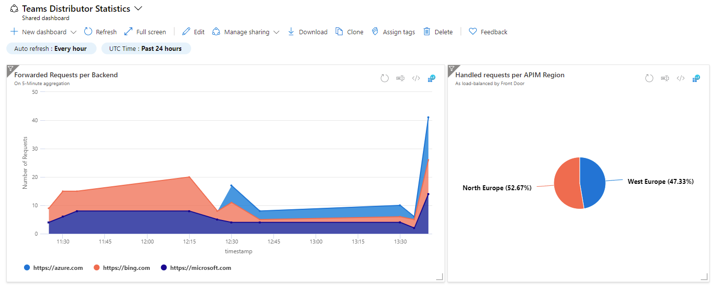

# Azure Portal Dashboard with data from Application Insights

This sample shows how to create a shared Dashboard on the Azure Portal which shows charts with data from Application Insights. Note: In order to see actual data, you need to connect the Application Insights instance to, for instance, with an Azure Function or an Azure App Service.

Sample screenshot (with slightly different data but the same charts and layout)
