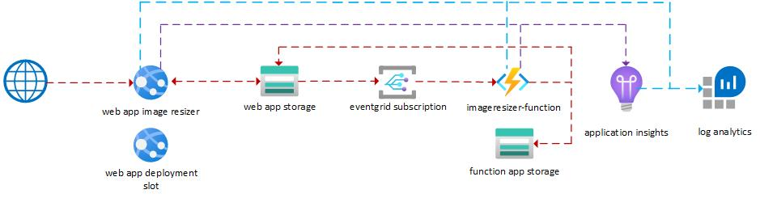

# Image Resizer - BICEP

## Description

The Image Resizer BICEP example deploys an application workload based on the tutorial "Tutorial: Upload Image Data in the Cloud with Azure Storage". Details on the solution can be found at the following two links:

- [Part 1 - Tutorial: Upload Image Data in the Cloud with Azure Storage](https://docs.microsoft.com/en-us/azure/storage/blobs/storage-upload-process-images?tabs=dotnet "Part 1 - Tutorial: Upload Image Data in the Cloud with Azure Storage ")
- [Part 2 - Tutorial: Automate Resizing Uploaded Images using Event Grid](https://docs.microsoft.com/en-us/azure/event-grid/resize-images-on-storage-blob-upload-event?toc=%2Fazure%2Fstorage%2Fblobs%2Ftoc.json&tabs=dotnet#create-an-event-subscription "Part 2 - Tutorial: Automate Resizing Uploaded Images using Event Grid ")

## Services Deployed

- Log Analytics Workspace
  - Diagnostics Settings are configured for each resource and data is sent to the Workspace
  - Application Insights is configured and data is sent to the Workspace
- App Service Plan (S1)
- Web App Storage Account
  - Images Container with access policy set to private
  - Thumbnails Container with access policy set to public
- Function Storage Account
- Application Insights (Web App and Function App)
- Web App (Front End)
  - Source Code Deployment
  - Deployment Slot
  - Source Code Deployment to Deployment Slot
- Function App (Back End)
  - Source Code Deployment
- Storage Account Event Grid Subscription
  - Triggers Function

## Files Used

- main.bicep
- main.json

The values for all parameters will be automatically generated based on the Resource Group ID (uniqueString(resourceGroup().id)
