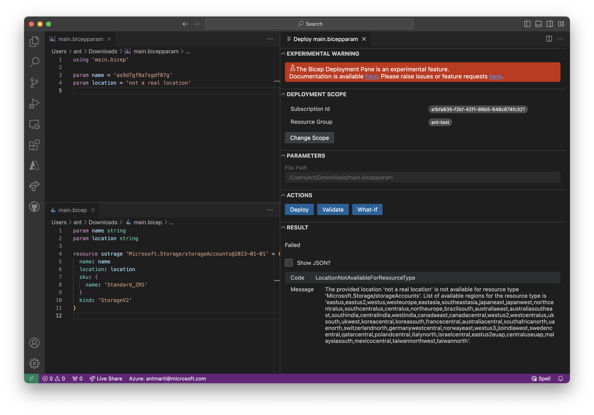
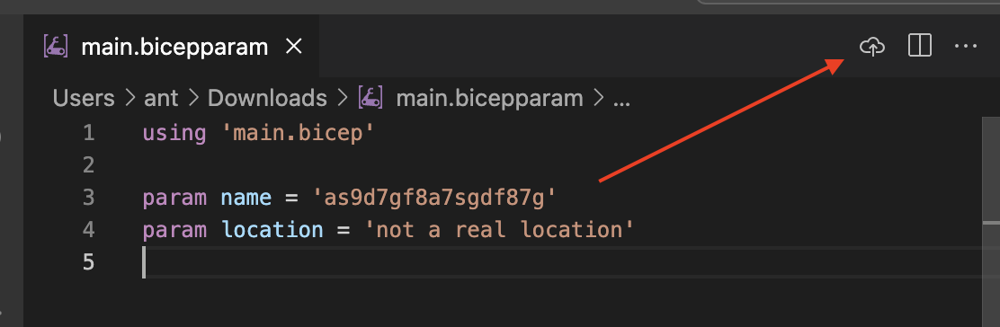
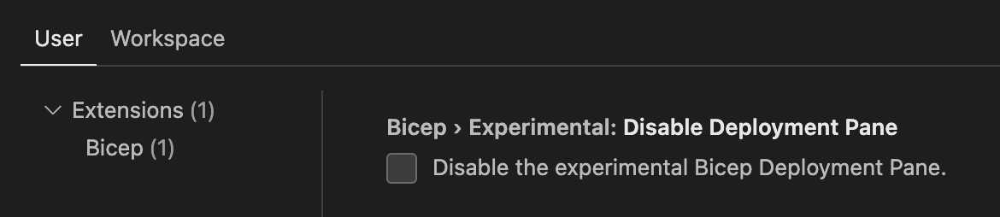

# Using the Deployment Pane (Experimental!)

## What is it?
The Deployment Pane is a UI panel in VSCode that allows you to connect to your Azure subscription and execute validate, deploy & whatif operations and get instant feedback without leaving the editor.

This feature is currently experimental while we collect feedback.

## Using
1. Open a `.bicep` or `.bicepparam` file in your editor.
1. Press the Deployment Pane button visible in the top right of your editor window.
    
1. Select a deployment scope with the "Pick Scope" button. This is only necessary if you haven't previously configured it for a given file, or wish to change the scope.
1. (if using a `.bicep` file) Select a JSON parameters file, or manually enter the parameters.
1. (if using a `.bicepparam` file) Change the parameter values if necessary.
1. Press either the `Validate`, `Deploy` or `WhatIf` buttons to submit your deployment to Azure and view results.

### Switching Tenants
Use the `Azure: Select Tenant` command from the VSCode Command Palette to change the tenant used by the deployment pane. If you need to log in to a different AAD account, then you may instead need to use the `Azure: Sign In` command.

## Notes
1. Changes you make in the editor are picked up immediately - you do not need to save the file.

## Disabling
1. You must be using Bicep VSCode extension v0.23 or later.
1. Check the "Experimental: Disable Deployment Pane" [VSCode setting](https://code.visualstudio.com/docs/getstarted/settings) to hide the functionality.
    

## Raising bugs or feature requests
Please raise bug reports or feature requests under [Bicep Issues](https://github.com/Azure/bicep/issues) as usual.
