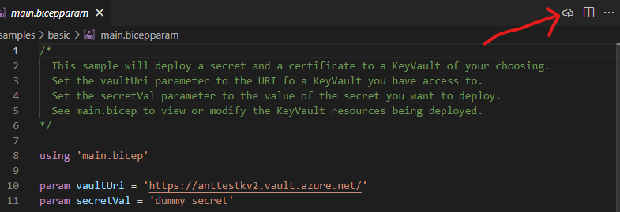
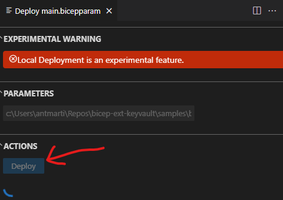

# Using Local Deploy (Experimental!)

> [!NOTE]
> This feature is currently experimental while we collect feedback.

## What is it?
Bicep Local Deploy can be used to author Bicep files which use Bicep extensions that are designed to run fully locally, without the need for an Azure connection.

Some examples of experimental extensions that have been created:
* [GitHub](https://github.com/anthony-c-martin/bicep-ext-github): Manage GitHub resources.
* [Local](https://github.com/anthony-c-martin/bicep-ext-local): Run bash or powershell scripts locally.
* [Http](https://github.com/anthony-c-martin/bicep-ext-http): Make HTTP requests.
* [KeyVault data plane](https://github.com/anthony-c-martin/bicep-ext-keyvault): Manage KeyVault data plane operations (secrets, certificates etc).
* [Kubernetes](https://github.com/anthony-c-martin/bicep-ext-kubernetes): Manage Kubernetes resources directly.

These extensions can be combined as you wish - for example, you could:
* Read kubernetes config using a bash script and deploy Kubernetes resources with the kubernetes extension
* Fetch secrets from KeyVault and upload them as GitHub secrets.

## Extension Quickstart
For a .NET-based quickstart guide for creating your own extension, see [Creating a Local Extension with .NET](./local-deploy-dotnet-quickstart.md).

## How to use it?

To try out a particular extension, follow the README instructions from one of sample extensions linked above.

### Interactive (Deploy Pane)
1. Open a `.bicepparam` file in your editor.
1. Press the Deployment Pane button visible in the top right of your editor window.

    
1. Press the `Deploy` buttons to deploy locally.

    

### Via CLI
1. Run:
    ```sh
    bicep local-deploy <path_to_bicepparam_file>
    ```

## Building your own extension
### Quickstart
Use one of the example repositories linked above as a starting point for creating your own extension.

### Implementation notes
A local extension consists of the following components:
* A binary executable which exposes the Bicep Extensibility Protocol over a [gRPC](https://grpc.io/) connection. This allows you to model interactions with your custom resource types. The gRPC contract is defined [here](../../src/Bicep.Local.Rpc/extension.proto).
* Type metadata stored in a structured JSON format. This allows Bicep to understand your custom resource types for editor validation and code completion. You can use packages defined in [bicep-types](https://github.com/Azure/bicep-types) to define and generate this structured format for your own custom resource types.

All extension binaries are expected to meet the following requirements:
1. Accept all of the following CLI arguments:
    * `--socket <socket_name>`: The path to the domain socket to connect on
    * `--pipe <pipe_name>`: The named pipe to connect on
    * `--wait-for-debugger`: Signals that you want to debug the extension, and that execution should pause until you are ready.
1. Once started (either via domain socket or named pipe), exposes a gRPC endpoint over the relevant channel, adhereing to the [extension gRPC contract](../../src/Bicep.Local.Rpc/extension.proto).
1. Responds to SIGTERM to request a graceful shutdown.

For .NET applications, there is a [NuGet package](https://www.nuget.org/packages/Azure.Bicep.Local.Extension) available which abstracts most of the above implementation.

### Debugging
Use [the debugging guide](./local-deploy-dotnet-debugging-guide.md) for helpful tips on debugging your extension during development using Visual Studio or VS Code.

### Unit testing
Use the [unit testing guide](./local-deploy-dotnet-unittesting-guide.md) for some tips on how to unit test your extension.

### Publishing
Extensions can be published using the `bicep publish-extension` CLI command group. They can either be published to the local file system, or to an ACR instance.

The command takes the following structure:
```sh
bicep publish-extension \
  --bin-osx-arm64 <path_to_osx_arm64_binary> \
  --bin-linux-x64 <path_to_linux_x64_binary> \
  --bin-win-x64 <path_to_windows_x86_binary> \
  --target <path_or_acr_reference_to_output_extension> \
  --force
```

* `--target` must be either a local file system path, or an ACR registry spec string (e.g. `br:bicepextdemo.azurecr.io/extensions/keyvault:0.1.3`).
* `--bin-<platform>` options signifiy different os/architecture flavors that are supported. These are optional - you don't need to support all architectures. If you don't support a particular option, then your extension will fail to run on that platform. Current options are: `linux-x64`, `linux-arm64`, `osx-x64`, `osx-arm64`, `win-x64` and `win-arm64`.

### Consuming
Here's an example bicepconfig.json you can use to share your extension with other users:
```json
{
  "experimentalFeaturesEnabled": {
    "localDeploy": true
  },
  "cloud": {
    "credentialPrecedence": [
      "AzureCLI"
    ],
    "currentProfile": "AzureCloud"
  },
  "extensions": {
    "http": "br:bicepextdemo.azurecr.io/extensions/http:0.1.1"
  },
  "implicitExtensions": []
}
```

* You will need to update `extensions.http`: the key (`http`) should be the name of your extension, and the value (`br:bicepextdemo.azurecr.io/extensions/http:0.1.1`) should be the OCI reference path (or relative local file system path if building locally).

### Troubleshooting

The following environment variables can be used to enable detailed logging for extension binary stdout, stderr and gRPC requests & responses. This can be useful for extension authors to troubleshoot problems invoking extensions.

Note that this can include sensitive data, and should only be used for local debugging.

1. (Mac/Linux) Run the following:
   ```sh
   export BICEP_TRACING_ENABLED=true
   ```
1. (Windows) Run the following in a PowerShell window:
   ```powershell
   $env:BICEP_TRACING_ENABLED = $true
   ```

## Limitations
1. Code signing for the proof-of-concept extensions has not been implemented, meaning you may run into errors running the samples on a Mac.
1. Secure outputs are not currently supported.

## Raising bugs or feature requests
Please raise bug reports or feature requests under [Bicep Issues](https://github.com/Azure/bicep/issues) as usual.
