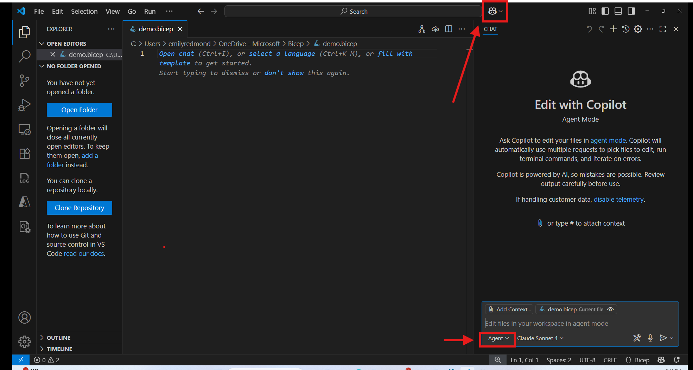
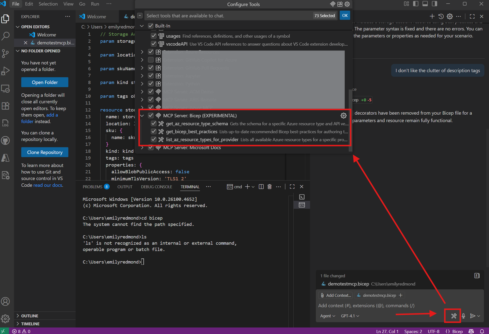
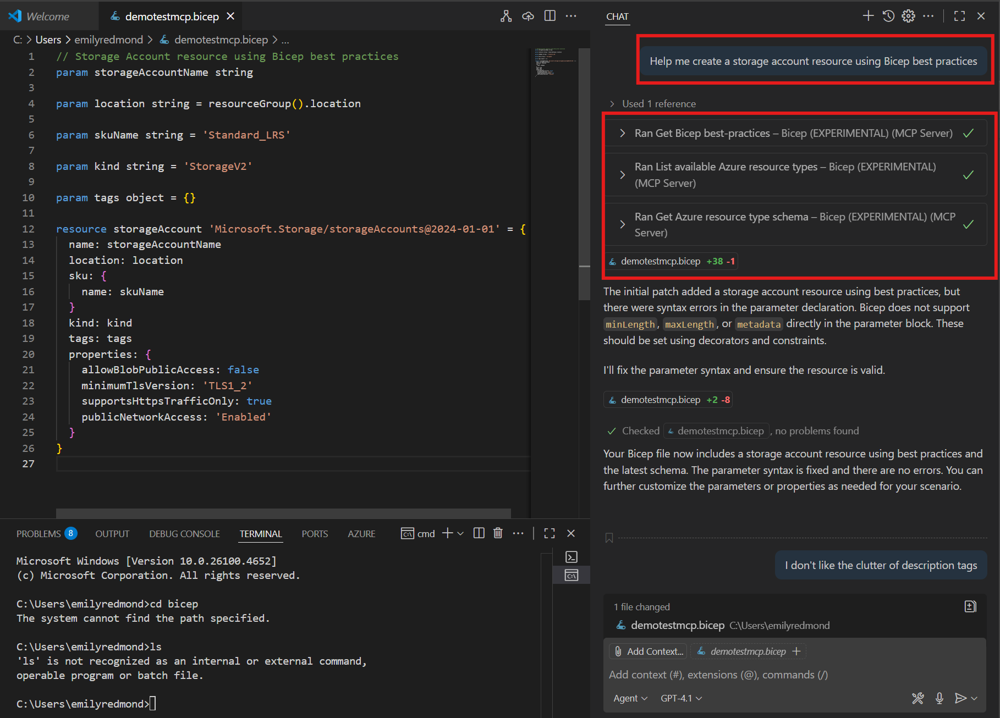

# Using Bicep MCP Server in VS Code (Experimental!)

> [!NOTE]
> This feature is currently Experimental while we collect feedback.

## What is it?
The Bicep VS Code extension now includes a Bicep MCP server with agentic tools to support Bicep code generation for AI agents in VS Code. To find out more about MCP, see [Use MCP servers in VS Code](https://code.visualstudio.com/docs/copilot/chat/mcp-servers).

### Available Bicep MCP tools
- `list_az_resource_types_for_provider`: Lists all available Azure resource types for a specific provider. The return value is a newline-separated list of resource types including their API version, e.g. `Microsoft.KeyVault/vaults@2024-11-01`. Such information is the most accurate and up-to-date as it is sourced from the Azure Resource Provider APIs.
- `get_az_resource_type_schema`: Gets the schema for a specific Azure resource type and API version. Such information is the most accurate and up-to-date as it is sourced from the Azure Resource Provider APIs.
- `get_bicep_best_practices`:  Lists up-to-date recommended Bicep best-practices for authoring templates. These practices help improve maintainability, security, and reliability of your Bicep files. This is helpful additional context if you've been asked to generate Bicep code.

Please see below on how to contribute to the Bicep best practices tool.

## How to use it?
### Prerequisites
- Install the latest version of the [Bicep VS Code Extension](https://marketplace.visualstudio.com/items?itemName=ms-azuretools.vscode-bicep)
- Confirm access to [Copilot in VS Code](https://code.visualstudio.com/docs/copilot/overview)

### Installing
Ensure you have the latest version of the Bicep extension installed.

### Troubleshooting
The Bicep server may not appear in your list of MCP servers and tools in VS Code until it has been triggered. If you do not see the server, try opening and saving a `.bicep` file and then try providing a Bicep related-prompt in the Copilot chat window in "Agent" mode (as shown in Step #3 of the Viewing and Using Bicep Tools in the Bicep MCP Server section below). You may also need to press the "Refresh" button in the Copilot chat box.

## Viewing and Using Bicep Tools in the Bicep MCP Server
1. Open the GitHub copilot extension window and select "Agent Mode".

2. Click on the tool icon in the GitHub copilot chat window and search for "Bicep (PREVIEW)".

3. Start using Agent Mode to help with your Bicep tasks!

## Limitations
> [!NOTE]
> It is your responsibility to review all code generated by an LLM and **deploy at your own risk**.

These tools provide additional context to help the chosen model generate semantically and syntactically correct Bicep code. These tools are not designed to deploy directly to Azure.

There is no way to definitively guarantee whether the agent orchestrator will use any particular Bicep tool. As a workaround, you can view the available Bicep tools and use specific prompting to guide the agent orchestrator to invoke a tool (e.g. "Create a Bicep file to do X using Bicep best practices")

## Contributing and providing feedback
These tools are early on and we value and welcome feedback to improve them. See `CONTRIBUTING.md` for guidelines.

In particular, we are looking to crowd source community wisdom on the `get_bicep_best_practices` tool. You can contribute to our forum on bicep best practices on [this Bicep Issue](https://github.com/Azure/bicep/issues/17660).

## Raising bugs or feature requests
Please raise bug reports or feature requests under [Bicep Issues](https://github.com/Azure/bicep/issues) and tag with "story: bicep MCP".
