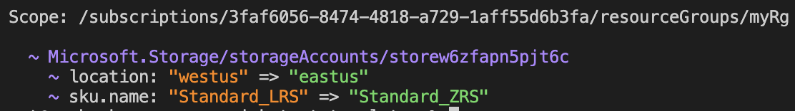

# Using the `snapshot` command (Experimental!)

## What is it?

The `snapshot` command group can be used to generate a normalized list of resources to file, which can then be used to generate a visual diff for changes. This could be used similarly to Snapshot Testing for HTML, and it can also be helpful to understand how expressions will be evaluated in a complex deployment.

**Important:** The `snapshot` command is only available in the standalone Bicep CLI and does not work through Azure CLI (`az bicep`). This means `az bicep snapshot` functionality is not available - you must use the standalone `bicep` executable to access this experimental feature.

## Usage

### Overwrite a snapshot

The `--mode overwrite` flag can be used to generate a file named `main.snapshot.json`. This file contains a normalized list of resources which contains concrete values where possible, and is agnostic to the module structure, making it resilient to refactoring, and useful to inspect the impact of a refactor.

```sh
bicep snapshot main.bicepparam --mode overwrite
```

You can optionally pass specific values for subscriptionId, resourceGroup, location and tenantId if you want to use these instead of placeholders:

```sh
bicep snapshot main.bicepparam --subscription-id 3faf6056-8474-4818-a729-1aff55d6b3fa --resource-group myRg --location westus --mode overwrite
```

### Validate a snapshot

The `--mode validate` flag generates a visual diff similar to the diff we render for a [live what-if](https://learn.microsoft.com/azure/azure-resource-manager/bicep/deploy-what-if), comparing the previous and new snapshot. This gives you the ability to quickly understand the impact of a refactor without making any requests, and without having to account for noise.

```sh
bicep snapshot main.bicepparam --mode validate
```

Example output:


## Raising bugs or feature requests

Please raise bug reports or feature requests under [Bicep Issues](https://github.com/Azure/bicep/issues) as usual.
