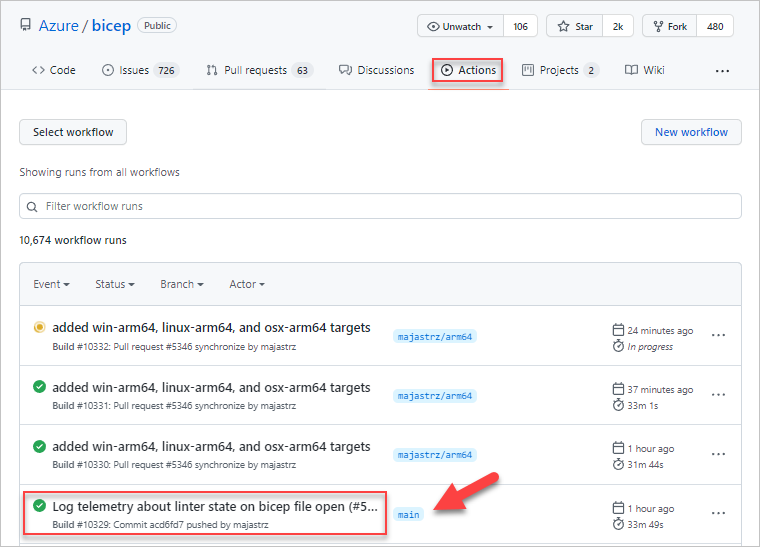

# Installing the "Nightly" build of Bicep CLI and VS Code extension

>**Note**: only install the nightly if you'd like to try the bleeding edge capabilities of Bicep. These are much more likely to have undiscovered bugs or other issues. If you find anything, please open an issue.

>**Note**: The Bicep VS code extension versions older than 0.2 must be uninstalled before or after the installation of the new version. Otherwise, both extension versions will run side by side and you will see duplicated and/or inconsistent errors. Versions 0.2 or newer do not require uninstallation and will upgrade correctly.

We are not currently publishing "nightly" releases, but you can grab the latest bits by viewing the latest Action workflows for the `main` branch (or any other branch).

The easiest way to get these artifacts is through the GitHub site. Follow [this link](https://github.com/Azure/bicep/actions) to view the latest Action workflows. Find the most recent build on the `main` branch and select it:

On the details page, select the artifact you would like to download.

The VSCode extension (`vscode-bicep.vsix`) must be unzipped and then can be installed inside of VS Code or with the `code` CLI. To install the extension, execute the following steps:
- Open VSCode.
- In the Extensions tab, select the options (...) menu in the top right corner and select 'Install from VSIX'. Provide the path to the VSIX file you downloaded.
- Click "Install".

The CLI (`bicep-release-*-x64`) should replace any current Bicep executable that has already been added to your PATH. If you are on Windows and previously installed using the installer (`bicep-setup-win-x64`), then downloading and running the new installer will replace the currently installed version of Bicep.
