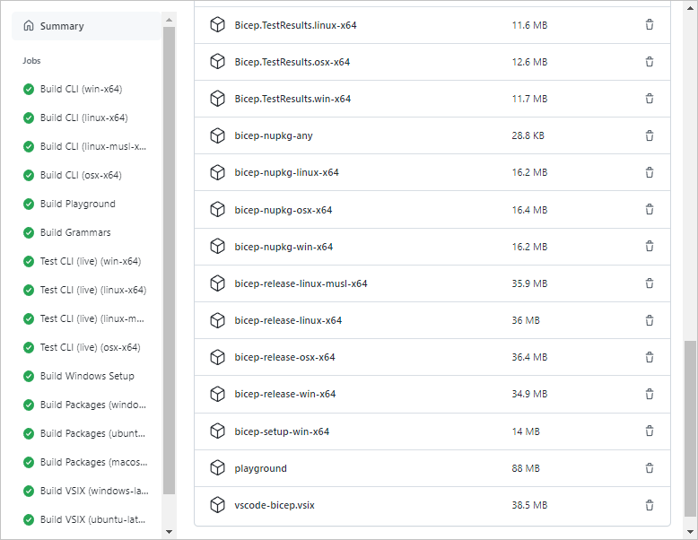

# Installing the "Nightly" build of Bicep CLI and VS Code extension

>**Note**: only install the nightly if you'd like to try the bleeding edge capabilities of Bicep. These are much more likely to have undiscovered bugs or other issues. If you find anything, please open an issue.

## Automatic
These steps only work on Linux or Mac platforms

### VSCode Extension
1. Run the following:
   ```sh
   bash <(curl -s https://raw.githubusercontent.com/Azure/bicep/main/scripts/install_vsix_nightly.sh)
   ```
1. Reload your VSCode window.

### Azure CLI
1. Run the following:
   ```sh
   bash <(curl -s https://raw.githubusercontent.com/Azure/bicep/main/scripts/install_cli_nightly.sh)
   ```
1. Your Azure CLI install should now be referencing the latest nightly Bicep CLI release.

### Targeting a particular build or branch
The following optional arguments are also supported in the nightly install scripts:
- Installing from a GitHub branch (VSCode extension):
   ```sh
   bash <(curl -s https://raw.githubusercontent.com/Azure/bicep/main/scripts/install_vsix_nightly.sh) --branch jeskew/variable-imports
   ```
- Installing from a GitHub branch (CLI):
   ```sh
   bash <(curl -s https://raw.githubusercontent.com/Azure/bicep/main/scripts/install_cli_nightly.sh) --branch jeskew/variable-imports
   ```
- Installing from a GitHub Action run (VSCode extension):
   ```sh
   bash <(curl -s https://raw.githubusercontent.com/Azure/bicep/main/scripts/install_vsix_nightly.sh) --run-id 6146657618
   ```
- Installing from a GitHub Action run (CLI):
   ```sh
   bash <(curl -s https://raw.githubusercontent.com/Azure/bicep/main/scripts/install_cli_nightly.sh) --run-id 6146657618
   ```

## Manual
We are not currently publishing "nightly" releases, but you can grab the latest bits by viewing the latest Action workflows for the `main` branch (or any other branch).

The easiest way to get these artifacts is through the GitHub site. Follow [this link](https://github.com/Azure/bicep/actions/workflows/build.yml?query=branch%3Amain+is%3Asuccess) to view the latest successful Action workflows for the `main` branch. Select it to show the related artifacts:


On the details page, select the artifact you would like to download.



The VSCode extension (`vscode-bicep.vsix`) must be unzipped and then can be installed inside of VS Code or with the `code` CLI. To install the extension, execute the following steps:
- Open VSCode.
- In the Extensions tab, select the options (...) menu in the top right corner and select 'Install from VSIX'. Provide the path to the VSIX file you downloaded.
- Click "Install".

The CLI (`bicep-release-*-x64`) should replace any current Bicep executable that has already been added to your PATH. If you are on Windows and previously installed using the installer (`bicep-setup-win-x64`), then downloading and running the new installer will replace the currently installed version of Bicep.
