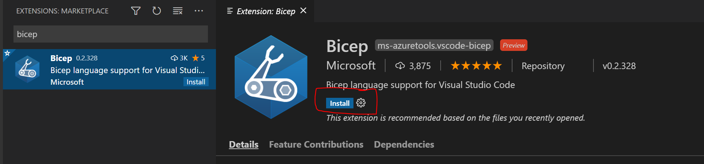

# Setup your Bicep development environment

To get the best Bicep authoring experience, you will need two components:

* Bicep CLI (required) - Compiles Bicep files into ARM templates. Cross-platform.
* Bicep VS Code Extension - Authoring support, intellisense, validation. Optional, but recommended.

<br/>
<br/>
<br/>

## Options for installing the Bicep CLI

* cross-plat
  * [via Az CLI](#install-and-manage-via-azure-cli-easiest)
  * via Az PowerShell (coming soon)
* Windows
  * [Windows Installer](#windows-installer)
  * [Chocolatey](#via-chocolatey)
  * [WinGet](#via-winget)
  * [Manual](#manual-with-powershell)
* macOS
  * [Homebrew](#via-homebrew)
  * [Manual](#macos-manual-install)
* Linux
  * [Manual](#linux)
* [Nightly build](#install-the-nightly-builds) (*experimental*)

<br/>
<br/>
<br/>

## Install the Bicep VS Code extension

Either inside of VS Code in the "Extensions" tab or in the Visual Studio marketplace, search for `bicep` and follow the prompts to install.



To veryify the extension is installed, open any file with a `.bicep` file extension. If the extension is properly installed, you should see the `language mode` in the lower right corner of the VS code window change to `bicep`.

>**Note**: The Bicep VS code extension versions prior to v0.2 must be uninstalled before or after the installation of the new version. Otherwise, both extension versions will run side by side and you will see duplicated and/or inconsistent errors. Versions 0.2 or newer do not require uninstallation and will upgrade correctly.

<br/>
<br/>
<br/>


## Next steps

Now that you have the tooling installed, you can start the tutorial which will teach you all of the Bicep capabilities:

[1 - Working with a basic bicep file](./tutorial/01-simple-template.md)

<br/>
<br/>
<br/>

## Install the Bicep CLI (details)

### Install and manage via Azure CLI (easiest)

If you already have the latest version of Az CLI installed (v2.20.0 or later), the Bicep CLI will automatically be installed when a command that depends on it is executed (`az deployment ... -f *.bicep` or `az bicep ...`).

You can also manually install the CLI using the built-in commands:

```bash
az bicep install
```

You can upgrade to the latest version:

```bash
az bicep upgrade
```

Or you can install a specific version:

```bash
az bicep install --version v0.2.212
```

>**Note:** Az CLI will install a separate version of the Bicep CLI that will not conflict with any other Bicep installs you may have and Az CLI will *not* add Bicep to your PATH.

### Install and manage via Azure PowerShell

The Azure PowerShell module does not yet have the capability to install the Bicep CLI. Azure PowerShell (v5.6.0 or later) expects that the Bicep CLI is already installed and available on the PATH. Follow one of the [manual install methods](#manually-install) below. Once the Bicep CLI is installed, it will be called whenever it is required for a deployment cmdlet (i.e. `New-AzResourceGroupDeployment ... -TemplateFile main.bicep`).

### Manually install

All of the following methods will install the Bicep CLI and add it to your PATH.

#### Linux
```sh
# Fetch the latest Bicep CLI binary
curl -Lo bicep.bin https://github.com/Azure/bicep/releases/latest/download/bicep-linux-x64
# Mark it as executable
chmod +x ./bicep.bin
# Add bicep to your PATH (requires admin)
sudo mv ./bicep.bin /usr/local/bin/bicep
# Verify you can now access the 'bicep' command
bicep --help
# Done!
  
```

#### macOS

##### via homebrew

```sh
# Add the tap for bicep
brew tap azure/bicep

# Install the tool
brew install bicep
```

##### macOS manual install

```sh
# Fetch the latest Bicep CLI binary
curl -Lo bicep https://github.com/Azure/bicep/releases/latest/download/bicep-osx-x64
# Mark it as executable
chmod +x ./bicep
# Add Gatekeeper exception (requires admin)
sudo spctl --add ./bicep
# Add bicep to your PATH (requires admin)
sudo mv ./bicep /usr/local/bin/bicep
# Verify you can now access the 'bicep' command
bicep --help
# Done!
  
```

#### Windows

#### Windows Installer
* Download the [latest Windows installer](https://github.com/Azure/bicep/releases/latest/download/bicep-setup-win-x64.exe).
* Run the downloaded executable. The installer does not require administrative privileges.
* Step through the installation wizard.
* After the installation, Bicep CLI will be added to your user PATH. If you have any command shell windows open (`cmd`, `PowerShell`, or similar), you will need to close and reopen them for the PATH change to take effect.

#### via Chocolatey

```powershell
choco install bicep
```

#### via winget

```powershell
winget install -e --id Microsoft.Bicep
```

#### Manual with PowerShell
```powershell
# Create the install folder
$installPath = "$env:USERPROFILE\.bicep"
$installDir = New-Item -ItemType Directory -Path $installPath -Force
$installDir.Attributes += 'Hidden'
# Fetch the latest Bicep CLI binary
(New-Object Net.WebClient).DownloadFile("https://github.com/Azure/bicep/releases/latest/download/bicep-win-x64.exe", "$installPath\bicep.exe")
# Add bicep to your PATH
$currentPath = (Get-Item -path "HKCU:\Environment" ).GetValue('Path', '', 'DoNotExpandEnvironmentNames')
if (-not $currentPath.Contains("%USERPROFILE%\.bicep")) { setx PATH ($currentPath + ";%USERPROFILE%\.bicep") }
if (-not $env:path.Contains($installPath)) { $env:path += ";$installPath" }
# Verify you can now access the 'bicep' command.
bicep --help
# Done!
```

#### Install the nightly builds of bicep (experimental)

If you'd like to try the latest pre-release bits of Bicep before they are released, you can [follow instructions for installing the nightly builds](./installing-nightly.md). Note, these builds are much more likely to have known or unknown bugs.
