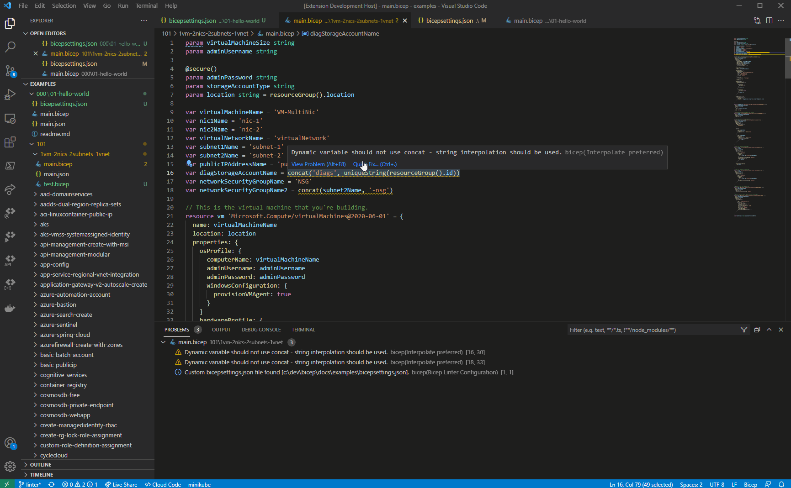

# Linter

The Bicep linter will inspect your code and catch a customizable set of authoring best practices. It will surface warnings, errors, or informational messages as you're typing in VS Code for immediate feedback. This means you don't have to build or deploy your code to find out that you've made a mistake. Some rules can also surface an automatic code fix through the VS Code light bulb. 

The linter should make it easier to enforce team coding standards by providing guidance during the development inner loop, as well as the ability to break a build (if desired) during continuous integration (CI) for violations.



## Configuration

[`bicepconfig.json`](../src/Bicep.Core/Configuration/bicepconfig.json) can be used to:

- enable/disable analyzer
- set rule-specific values (e.g. DisallowedHosts for [`no-hardcoded-env-urls`](./linter-rules/no-hardcoded-env-urls.md) rule)
- set level of rules:

| **level**  | **Build-time behavior** | **Editor behavior** |
|--|--|--|
| `Error` | Violations appear as Errors in command-line build output, and cause builds to fail. | Offending code is underlined with a red squiggle and appears in Problems tab. |
| `Warning` | Violations appear as Warnings in command-line build output, but do not cause builds to fail. | Offending code is underlined with a yellow squiggle and appears in Problems tab. |
| `Info` | Violations do not appear in command-line build output. | Offending code is underlined with a blue squiggle and appears in Problems tab. |
| `Off` | Suppressed completely. | Suppressed completely. |

`bicepconfig.json` can be placed alongside your templates in the same directory. The closest configuration file found up the tree will be used.

## Default rules

There are a set of core rules that are enabled by default, set to `Warning` level. You can find their descriptions in the [`./linter-rules`](./linter-rules) folder.

## Future

The linter is being designed to be extensible so new rules can be added by either the Bicep team or the community. In the 0.5 milestone, we will be focusing more on extensibility, making it as easy as possible to contribute new rules and/or analyzers.

If you have an idea for a new rule, please [submit a feature request](https://github.com/Azure/bicep/issues/new?assignees=&labels=enhancement,linting-rule-idea&template=feature_request.md&title=).

## ARM Template Tool Kit (arm-ttk)

We've ported over most of the rules from the [ARM template test toolkit (arm-ttk)](https://docs.microsoft.com/azure/azure-resource-manager/templates/test-toolkit) into the bicep linter and are working on porting the rest.  Until the unification is complete you can run the arm-ttk on the JSON file generated from the ```bicep build``` command.  Actions for [bicep build](https://github.com/search?q=bicep&type=marketplace) or [running the arm-ttk](https://github.com/search?q=arm-ttk&type=marketplace) in a github workflow can be found in the marketplace.

If you run into any issues using the arm-ttk on bicep generated files, file an issue in the [arm-ttk repo](https://github.com/Azure/arm-ttk/issues).
