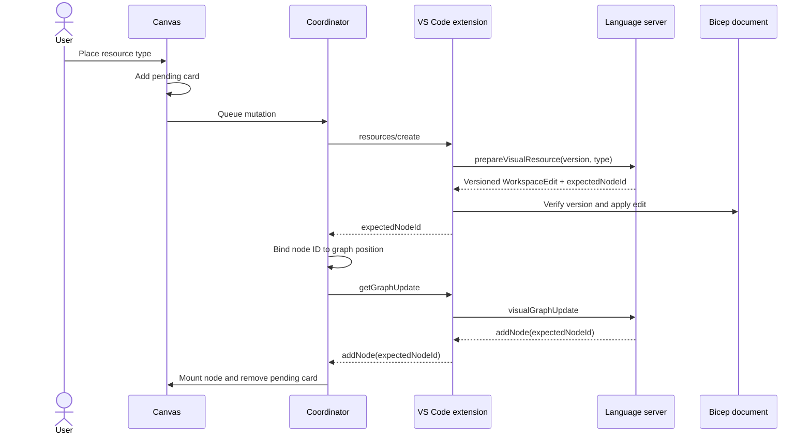

# Visual Designer Architecture

The visual designer is a React webview backed by the current Bicep compilation. The language server
owns graph construction and source generation; the webview owns rendering, measured layout, and user
interaction.

## Participants

| Participant       | Responsibility                                                                                    |
| ----------------- | ------------------------------------------------------------------------------------------------- |
| Language server   | Build the authoritative graph, compute layout, validate resource types, and generate Bicep syntax |
| VS Code extension | Bind requests to a document, forward LSP messages, apply edits, and publish settings              |
| Webview           | Maintain a client graph, render and measure nodes, coordinate updates, and provide interaction    |

The webview message contracts are defined by feature:

- [Canvas API](../src/features/canvas/api.ts): graph updates, layout, source navigation, and resource creation
- [Palette API](../src/features/palette/api.ts): enablement and resource type catalog

## Graph synchronization

Graph reconciliation and layout are separate phases because layout uses dimensions measured after
React renders the nodes.


### Update contract

`getGraphUpdate` submits the graph currently rendered by the webview, or `null` on first load. The
response is an ordered `GraphPatch[]` that transforms the submitted graph into the latest server
graph.

### Layout contract

`getGraphLayout` submits `RenderedGraph`, which contains topology, render-relevant metadata, and
measured node dimensions. Positions are not sent to the server.

The response status controls the next step:

| Status         | Client action                                  |
| -------------- | ---------------------------------------------- |
| `ok`           | Apply node positions and optional graph bounds |
| `graphChanged` | Reconcile and retry the same layout mode       |
| `layoutFailed` | Reveal the graph at its current positions      |

Both update and layout responses currently use this patch set:

```text
clearGraph
addNode / removeNode / updateNode
addEdge / removeEdge
setNodeLayout
setGraphBounds
setErrorCount
```

Source locations are resolved on demand through `revealNodeSource` and are not stored in graph
metadata.

### Layout invalidation

Layout may be stale after:

- Graph clear
- Node or edge addition/removal
- Changes to node `type`, `isCollection`, or `hasChildren`

A correlated resource node with an explicit placement does not invalidate layout by itself. Changes
limited to `hasError`, error count, positions, or graph bounds do not invalidate layout.

After an invalidating patch, the webview renders and measures the graph. It requests layout only when
topology or dimensions differ from the last successful layout input.

- Automatic layout may skip unchanged input and fits the viewport after success.
- **Reset Graph Layout** bypasses the unchanged-input check and preserves the viewport.

### Client implementation

| Module                                                                              | Responsibility                                                              |
| ----------------------------------------------------------------------------------- | --------------------------------------------------------------------------- |
| [graph-model.ts](../src/features/canvas/graph-model.ts)                             | Client graph, patch application, measured projection, and render comparison |
| [graph-layout.ts](../src/features/canvas/graph-layout.ts)                           | Layout invalidation, response extraction, and centering                     |
| [graph-update-coordinator.ts](../src/features/canvas/graph-update-coordinator.ts)   | Update/layout ordering, coalescing, and mutation serialization              |
| [use-canvas-controller.ts](../src/features/canvas/hooks/use-canvas-controller.ts)   | API, model, placement, and Jotai integration                                |
| [use-apply-graph.ts](../src/features/canvas/hooks/use-apply-graph.ts)               | Node and edge reconciliation                                                |
| [use-apply-graph-layout.ts](../src/features/canvas/hooks/use-apply-graph-layout.ts) | Graph reveal and position animation                                         |

The coordinator tracks pending update and layout work independently:

- Reconciliation runs before layout.
- Reset layout takes precedence over automatic layout.
- Repeated update notifications coalesce.
- `graphChanged` schedules reconciliation and retries the same layout mode.
- Request promises settle after all currently pending work completes.

The language server is stateless between requests. It rebuilds the authoritative graph from the live
compilation and validates measured layout input before computing positions.

## Resource creation

Resource creation is enabled with:

```json
"bicep.visualizer.experimental.enableResourceCreation": true
```

It creates top-level Azure resources from the Resource Palette. The Bicep source file remains the
only durable source of truth.

### Catalog and placement

- Opening the palette loads provider namespaces and resource counts.
- Expanding a provider loads and caches its resource types.
- Search loads the complete searchable catalog once and filters it locally.
- Catalog responses carry a `catalogId`; stale responses are discarded.
- Pointer drops are accepted only over the canvas DOM subtree.
- Keyboard activation places a resource at the viewport center.

Accepted client coordinates are converted using the canvas bounds and pan/zoom transform:

```text
graphX = (clientX - canvasLeft - panX) / zoom
graphY = (clientY - canvasTop  - panY) / zoom
```

### Creation flow



### Source generation

The language server validates the exact resource type and API version, then generates:

- A deterministic symbolic name with a numeric suffix when needed
- Required property names, including nested required object structure
- A resource name derived from the symbolic name
- An exact `location` parameter, or `resourceGroup().location` at resource-group scope when none exists
- Unambiguous singleton literal values
- Empty values for all other properties that require user input
- Formatted Bicep syntax in a versioned `WorkspaceEdit`

Required-property generation shares completion's ordering, escaping, and requiredness rules. A
discriminated body includes only its empty discriminator property because creation has no branch
selection UI. Value heuristics are visual-creation behavior and do not affect completion.
`unresolvedRequiredProperties` remains in the response for protocol compatibility.

The extension verifies the document version immediately before applying the edit. The edit uses
native dirty-file and undo/redo behavior and does not save the document. Reconciliation replaces the
pending card with the canonical node without changing editor focus. Users can explicitly reveal a
node's declaration through the existing source-navigation interaction.

### Mutation interlock

Resource creation uses the same graph coordinator:

- Creation mutations run one at a time.
- A graph response that overlaps a mutation is discarded.
- The create response binds `expectedNodeId` to the requested graph position.
- Reconciliation places the matching node at that position.
- Failed mutations still trigger normal graph reconciliation.

The explicitly placed node does not trigger automatic layout by itself. Unrelated topology changes
still request layout, and Reset Graph Layout may move the node later.

Placement and pending state last for the visualizer session only.

## State ownership

| Area            | State                                                                           |
| --------------- | ------------------------------------------------------------------------------- |
| Canvas          | Client graph, pending resources, placement correlation, and update coordination |
| Palette         | Enablement, catalog, search, drag state, and preview                            |
| Export          | Export options, preview visibility, target element, and progress                |
| Status          | User-facing graph status                                                        |
| App environment | Jotai store, message channel, document sync, motion policy, and theme           |

Jotai stores shared observable state. The canvas controller owns its client graph, mutation queue, and
expected-node placement map. Canvas actions are exposed through `useCanvasActions`.

## Errors and limitations

| Case                                        | Behavior                                               |
| ------------------------------------------- | ------------------------------------------------------ |
| Layout computation fails                    | Keep current positions and reveal the graph            |
| Catalog request fails                       | Show retry UI                                          |
| Drop is outside the canvas                  | Cancel without changing source                         |
| Resource type or API version is unavailable | Remove pending state and show an error                 |
| Document version changed                    | Reject the edit                                        |
| Workspace edit rejected                     | Remove pending state and show an error                 |
| Required values are unresolved              | Emit empty values for later source editing              |

Current limitations:

- Update and layout responses share one `GraphPatch` union.
- Resource-creation failure UI is not covered by the fake-host E2E suite.
- Webview and extension protocol declarations are not generated from one schema.
- There is no pending-operation timeout.
- Resource lists are not virtualized.
- Manual layout is not persisted.

## Validation

- Language-server tests cover graph diffing, layout, catalog behavior, naming, source generation, and
  insertion.
- Extension tests cover forwarding, settings, document version checks, and edit application.
- Vitest covers webview atoms, graph model/layout behavior, export state, and coordinator ordering.
- Playwright covers graph interaction, export, palette behavior, loading, search, pointer placement,
  drop rejection, and keyboard creation.
