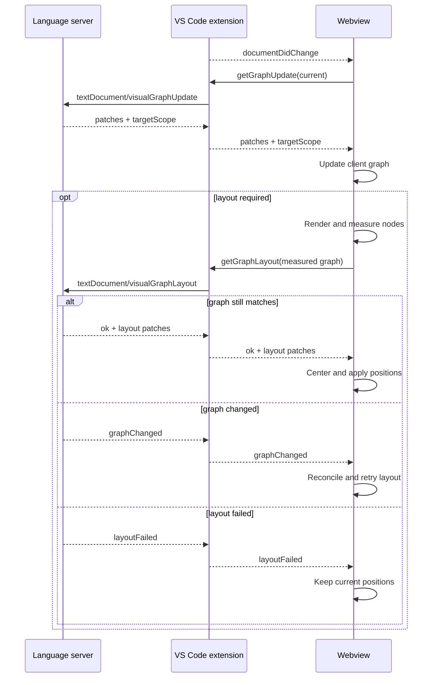
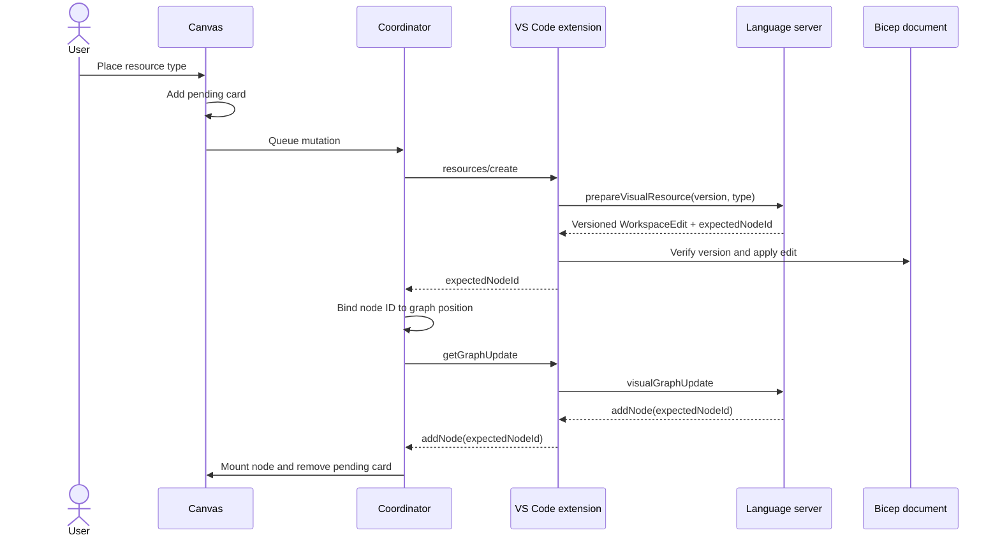

# Visual Designer Architecture

The visual designer is a React webview backed by the current Bicep compilation. The language server
owns graph construction and source generation; the webview owns rendering, measured layout, and user
interaction.

## Participants

| Participant       | Responsibility                                                                                    |
| ----------------- | ------------------------------------------------------------------------------------------------- |
| Language server   | Build the authoritative graph, compute layout, validate resource types, and generate Bicep syntax |
| VS Code extension | Bind requests to a document, forward LSP messages, apply edits, and publish settings              |
| Webview           | Maintain a client graph, render and measure nodes, coordinate updates, and provide interaction    |

The webview message contracts are defined by feature:

- [Canvas API](../src/features/canvas/api.ts): graph updates, layout, source navigation, and resource creation
- [Palette API](../src/features/palette/api.ts): enablement and resource type catalog

## Graph synchronization

Graph reconciliation and layout are separate phases because layout uses dimensions measured after
React renders the nodes.



### Update contract

`getGraphUpdate` submits the graph currently rendered by the webview, or `null` on first load. The
response contains an ordered `patches: GraphPatch[]` that transforms the submitted graph into the latest
server graph, and a required `targetScope: "resourceGroup" | "subscription" | "managementGroup" | "tenant" | null`.
Null means no compiled model is available. Only accepted coordinator updates publish scope to canvas
state; superseded responses and responses overlapping mutations cannot overwrite it. Scope-only
changes do not invalidate graph layout or adjust zoom.

The passive scope indicator is outside the export canvas subtree, like the palette and controls.
It uses Azure resource-group, subscription-alias, and management-group icons; tenant uses the neutral
organization Codicon. It stays visible when resource creation is disabled.

### Layout contract

`getGraphLayout` submits `RenderedGraph`, which contains topology, render-relevant metadata, and
measured node dimensions. Positions are not sent to the server.

The response status controls the next step:

| Status         | Client action                                  |
| -------------- | ---------------------------------------------- |
| `ok`           | Apply node positions and optional graph bounds |
| `graphChanged` | Reconcile and retry the same layout mode       |
| `layoutFailed` | Reveal the graph at its current positions      |

Both update and layout responses currently use this patch set:

```text
clearGraph
addNode / removeNode / updateNode
addEdge / removeEdge
setNodeLayout
setGraphBounds
setErrorCount
```

Source locations are resolved on demand through `revealNodeSource` and are not stored in graph
metadata.

### Layout invalidation

Layout may be stale after:

- Graph clear
- Node or edge addition/removal
- Changes to node `type`, `isCollection`, or `hasChildren`

A correlated resource node with an explicit placement does not invalidate layout by itself. Changes
limited to `hasError`, error count, positions, or graph bounds do not invalidate layout.

After an invalidating patch, the webview renders and measures the graph. It requests layout only when
topology or dimensions differ from the last successful layout input.

- Automatic layout may skip unchanged input and fits the viewport after success.
- **Reset Graph Layout** bypasses the unchanged-input check and preserves the viewport.

### Client implementation

| Module                                                                              | Responsibility                                                              |
| ----------------------------------------------------------------------------------- | --------------------------------------------------------------------------- |
| [graph-model.ts](../src/features/canvas/graph-model.ts)                             | Client graph, patch application, measured projection, and render comparison |
| [graph-layout.ts](../src/features/canvas/graph-layout.ts)                           | Layout invalidation, response extraction, and centering                     |
| [graph-update-coordinator.ts](../src/features/canvas/graph-update-coordinator.ts)   | Update/layout ordering, coalescing, and mutation serialization              |
| [use-canvas-controller.ts](../src/features/canvas/hooks/use-canvas-controller.ts)   | API, model, placement, and Jotai integration                                |
| [use-apply-graph.ts](../src/features/canvas/hooks/use-apply-graph.ts)               | Node and edge reconciliation                                                |
| [use-apply-graph-layout.ts](../src/features/canvas/hooks/use-apply-graph-layout.ts) | Graph reveal and position animation                                         |

The coordinator tracks pending update and layout work independently:

- Reconciliation runs before layout.
- Reset layout takes precedence over automatic layout.
- Repeated update notifications coalesce.
- Responses superseded by notifications or mutations are discarded before applying graph or scope state.
- `graphChanged` schedules reconciliation and retries the same layout mode.
- Request promises settle after all currently pending work completes.

The language server is stateless between requests. It rebuilds the authoritative graph from the live
compilation and validates measured layout input before computing positions.

## Resource creation

Resource creation is enabled with:

```json
"bicep.visualizer.experimental.enableResourceCreation": true
```

It creates top-level Azure resources from the Resource Palette. The Bicep source file remains the
only durable source of truth.

### Catalog and placement

- Opening the palette loads provider namespaces. The response also carries per-namespace type counts,
  which the palette does not display. Browsing puts a curated set of common providers first (compute,
  networking, storage, app hosting, containers, secrets, identity and authorization, deployments,
  databases, caching, AI services, monitoring, and messaging), then lists other `Microsoft.*`
  namespaces alphabetically, followed by non-Microsoft namespaces alphabetically. Search results
  retain their catalog order.
- Expanding a provider loads and caches its resource types.
- Search loads the complete searchable catalog once and filters it locally.
- Catalog responses carry a `catalogId`; stale responses are discarded.
- The host supplies a newest-stable default API version (newest preview when preview-only).
- Focusing or opening a row's version pill requests `resourceTypeCatalog/versions` with
  `{ fullyQualifiedType }`, returning `{ catalogId, apiVersions: string[] }` newest first. Preview
  versions are included without a separate toggle.
- Version loading and failure/retry states are explicit inside the version list. The resource
  icon/type drag handle and the version pill are siblings, so selecting a version cannot initiate a drag
  or insert.
- The pill is a select-only combobox (`role="combobox"` + `listbox`, `aria-activedescendant`); focus
  stays on the pill. The list opens immediately and renders in the top layer via the Popover API, so
  the palette's scroll area and transformed ancestors never clip or offset it.
- Version choices are shared across browse/search views and palette reopen. A changed provider
  catalog clears choices and version caches; old in-flight responses cannot restore them.
- The catalog is filtered by the opened file's `targetScope`: a type is offered only if its default
  version is writable (deployable, not merely `existing`-readable) at that scope, because inserted
  resources are top-level declarations without a `scope` property. Namespaces with no remaining types
  are omitted, and extension-only types are excluded. Module target scopes are not considered, since
  drops always insert into the opened file.
- `catalogId` includes the target scope, so a scope change reads as a new catalog: the palette refetches
  and version choices reset. API-version lists are not filtered per version (that would load every
  version's type file); instead insertion rejects a chosen version that cannot be deployed at the scope.
- Writable scopes are read once per language-server session, on the first catalog query, straight from
  the serialized type files: each file is deserialized once (in parallel) rather than once per type,
  and no Bicep type is materialized. For the built-in Azure types this takes a few seconds; the
  per-type path it replaces took over thirty. The palette issues that first query when the visualizer
  opens, so the cost is normally paid before the palette is opened.
- Catalog requests are cheap once warm (namespaces and a namespace's types in about a millisecond, the
  full search catalog in about 15 ms), so the list is rendered progressively rather than paged or
  streamed: a shared budget of headers and rows starts at 50 and grows by 100 as the end of the rendered
  list scrolls within reach, collapsed groups cost only their header, and a new search query starts
  over. Rows are memoized so growing renders only the new rows, and growth runs as a React transition so
  it yields to scrolling and typing. At catalog scale (about 2,300 types) a search that matches
  everything renders about 700 palette DOM nodes instead of about 35,000.
- The list uses an overlay scrollbar (`ui/OverlayScrollArea`): the native bar is hidden so no width is
  reserved, and a thin thumb fades in while the list is hovered, scrolled (for 800 ms afterward), or the
  thumb is dragged. It stays hidden when nothing overflows. The thumb is a 4px pill in the theme's
  `scrollbar.thumb` color, 2px from the edge (clear of row highlights) and inset 12px from the top and
  bottom to match the popover's corner radius; a 12px hit area makes it easy to grab, and it widens to 6px in `scrollbar.thumbActive` while
  pointed at or dragged. Short lists such as the version popup hide their bar entirely.
- Pointer drops are accepted only over the canvas DOM subtree.
- Resources are created only by pointer drag; the drag handle is not focusable and has no click or
  keyboard activation. A press becomes a drag only past a 4px movement threshold, so a click inserts
  nothing and never shows the preview. Escape during a drag is consumed
  in the capture phase so it cancels the drag without also dismissing the palette.

The creation dock is an absolutely positioned bottom-center `FloatingPanel` and disabled Modules/Notes
affordances. As the primary creation surface it uses larger targets (36px buttons, 20px icons) than the
28px view controls, following FigJam's hierarchy. Its resource popover is 400px wide with a fixed 360px
height, shrinking only to fit the canvas viewport. 400px fits the 90th-percentile Azure resource type
name (child types included) on one line beside a stable API-version pill; longer names wrap. Search
stays pinned above scrolling results. Opening and closing
this UI does not resize, lay out, or zoom the graph. Escape, dock toggle, and outside-pointer dismissal
restore focus to Resources.

Accepted client coordinates are converted using the canvas bounds and pan/zoom transform:

```text
graphX = (clientX - canvasLeft - panX) / zoom
graphY = (clientY - canvasTop  - panY) / zoom
```

### Creation flow



### Source generation

The language server validates the exact resource type and API version, then generates:

- A deterministic symbolic name with a numeric suffix when needed
- Required property names, including nested required object structure
- A resource name derived from the symbolic name
- An exact `location` parameter, or `resourceGroup().location` at resource-group scope when none exists
- Unambiguous singleton literal values
- Empty values for all other properties that require user input
- Formatted Bicep syntax in a versioned `WorkspaceEdit`

Required-property generation shares completion's ordering, escaping, and requiredness rules. A
discriminated body includes only its empty discriminator property because creation has no branch
selection UI. Value heuristics are visual-creation behavior and do not affect completion.
`unresolvedRequiredProperties` remains in the response for protocol compatibility.

The extension verifies the document version immediately before applying the edit. The edit uses
native dirty-file and undo/redo behavior and does not save the document.

### Mutation interlock

Resource creation uses the same graph coordinator:

- Creation mutations run one at a time.
- A graph response that overlaps a mutation is discarded.
- The create response binds `expectedNodeId` to the requested graph position.
- Reconciliation places the matching node at that position.
- Failed mutations still trigger normal graph reconciliation.

The explicitly placed node does not trigger automatic layout by itself. Unrelated topology changes
still request layout, and Reset Graph Layout may move the node later.

Placement and pending state last for the visualizer session only.

## State ownership

| Area            | State                                                                           |
| --------------- | ------------------------------------------------------------------------------- |
| Canvas          | Client graph, pending resources, placement correlation, and update coordination |
| Dock            | Creation tools and palette launcher                                             |
| Palette         | Enablement, catalog, search, drag state, and preview                            |
| Export          | Export options, preview visibility, target element, and progress                |
| Status          | User-facing graph status                                                        |
| App environment | Jotai store, message channel, document sync, motion policy, and theme           |

Jotai stores shared observable state. The canvas controller owns its client graph, mutation queue, and
expected-node placement map. Canvas actions are exposed through `useCanvasActions`.

## Errors and limitations

| Case                                        | Behavior                                    |
| ------------------------------------------- | ------------------------------------------- |
| Layout computation fails                    | Keep current positions and reveal the graph |
| Catalog request fails                       | Show retry UI                               |
| Drop is outside the canvas                  | Cancel without changing source              |
| Resource type or API version is unavailable | Remove pending state and show an error      |
| Document version changed                    | Reject the edit                             |
| Workspace edit rejected                     | Remove pending state and show an error      |
| Required values are unresolved              | Emit empty values for later source editing  |

Current limitations:

- Update and layout responses share one `GraphPatch` union.
- Resource-creation failure UI is not covered by the fake-host E2E suite.
- Webview and extension protocol declarations are not generated from one schema.
- There is no pending-operation timeout.
- Resource lists are not virtualized.
- Manual layout is not persisted.

## Validation

- Language-server tests cover graph diffing, layout, catalog behavior, naming, source generation, and
  insertion.
- Extension tests cover forwarding, settings, document version checks, and edit application.
- Vitest covers webview atoms, graph model/layout behavior, export state, and coordinator ordering.
- Playwright covers graph interaction, export, palette behavior, loading, search, pointer placement,
  drop rejection, and drag-only creation.
