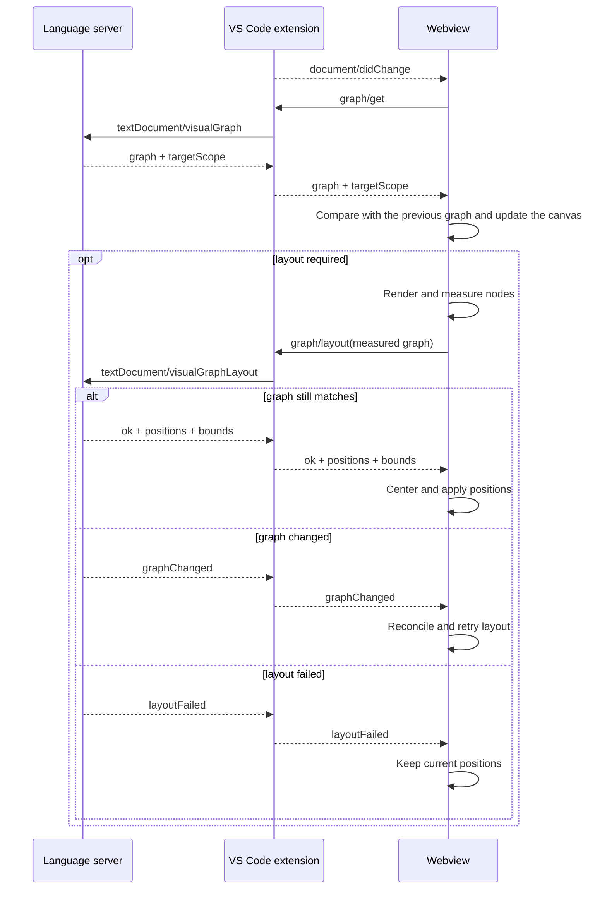
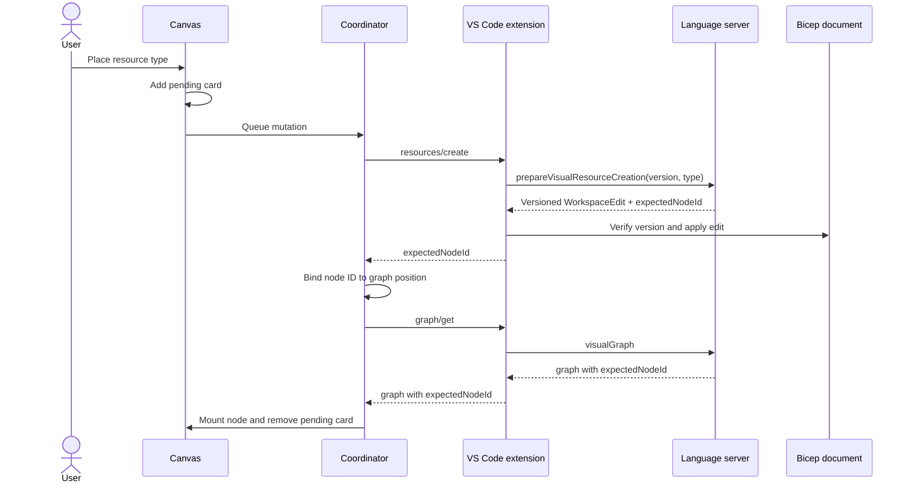

# Visual Designer Architecture

The visual designer is a React webview backed by the current Bicep compilation. The language server
owns graph construction and source generation; the webview owns rendering, measured layout, and user
interaction.

## Participants

| Participant       | Responsibility                                                                                    |
| ----------------- | ------------------------------------------------------------------------------------------------- |
| Language server   | Build the authoritative graph, compute layout, validate resource types, and generate Bicep syntax |
| VS Code extension | Bind requests to a document, forward LSP messages, apply edits, and publish settings              |
| Webview           | Maintain a client graph, render and measure nodes, coordinate updates, and provide interaction    |

The webview message contracts are defined by feature:

- [Core API](../src/core/api.ts): settings, graph, layout, source navigation, resource creation, and undo
- [Palette API](../src/features/palette/api.ts): resource type catalog and API versions

## Graph synchronization

Graph reconciliation and layout are separate phases because layout uses dimensions measured after
React renders the nodes.


```mermaid
sequenceDiagram
    participant LS as Language server
    participant Ext as VS Code extension
    participant UI as Webview

    Ext-->>UI: document/didChange
    UI->>Ext: graph/get
    Ext->>LS: textDocument/visualGraph
    LS-->>Ext: graph + targetScope
    Ext-->>UI: graph + targetScope
    UI->>UI: Compare with the previous graph and update the canvas

    opt layout required
        UI->>UI: Render and measure nodes
        UI->>Ext: graph/layout(measured graph)
        Ext->>LS: textDocument/visualGraphLayout
        alt graph still matches
            LS-->>Ext: ok + positions + bounds
            Ext-->>UI: ok + positions + bounds
            UI->>UI: Center and apply positions
        else graph changed
            LS-->>Ext: graphChanged
            Ext-->>UI: graphChanged
            UI->>UI: Reconcile and retry layout
        else layout failed
            LS-->>Ext: layoutFailed
            Ext-->>UI: layoutFailed
            UI->>UI: Keep current positions
        end
    end
```

### Graph contract

`graph/get` returns the whole graph (`nodes`, `edges`) built from the live compilation, the document's
`targetScope: "resourceGroup" | "subscription" | "managementGroup" | "tenant" | null`, and the
document's `errorCount`, which includes errors that belong to no node. The graph
is null when no compiled model is available, and the webview then keeps what it shows. A whole graph
rather than a delta means no response depends on what the webview showed before, so the host keeps no
state and responses need no ordering. The webview compares each graph with the previous one to decide
what to mount and whether layout is stale. Only accepted coordinator updates publish scope to canvas
state; superseded responses and responses overlapping mutations cannot overwrite it. Scope-only
changes do not invalidate graph layout or adjust zoom.

The passive scope indicator is outside the export canvas subtree, like the palette and controls.
It uses Azure resource-group, subscription-alias, and management-group icons; tenant uses the neutral
organization Codicon. It stays visible when resource creation is disabled.

### Layout contract

`graph/layout` submits a `MeasuredGraph`: node identity and containment, measured node dimensions,
and edges. Positions are not sent to the server. An `ok` response carries the positions of the nodes
the engine laid out and the bounds of the whole graph.

The response status controls the next step:

| Status         | Client action                                 |
| -------------- | --------------------------------------------- |
| `ok`           | Apply node positions and fit the graph bounds |
| `graphChanged` | Reconcile and retry the same layout mode      |
| `layoutFailed` | Reveal the graph at its current positions     |

Source locations are resolved on demand through `document/revealNode` and are not stored in graph
metadata.

### Layout invalidation

Layout may be stale when, compared with the previous graph:

- A node or edge was added or removed
- A node changed kind or container
- A node's `type`, `isCollection`, or `hasChildren` changed

A correlated resource node with an explicit placement does not invalidate layout by itself.
Undo of an independent top-level resource creation likewise removes only that node;
surviving positions and the camera stay put, even if the graph update arrives late. An edge
change or another layout-affecting change still requests layout. Changes limited to `hasError` or
the error count do not invalidate layout.

After an invalidating change, the webview renders and measures the graph. It requests layout only when
topology or dimensions differ from the last successful layout input.

- Automatic layout may skip unchanged input and fits the viewport after success.
- **Reset Graph Layout** bypasses the unchanged-input check and preserves the viewport.

### Undo history

A node drag records its atomic node position at the first actual movement and commits one history
step at the end of the gesture. Dragging a module records the positions of all its descendants in
one step. A successful Reset Layout records one step from the positions the nodes are settling at (the
targets of any animation it interrupts) to the server's layout; a failed or unchanged layout adds none. **Undo** and **Redo** are buttons in their own panel below the control bar;
the focused designer also accepts Ctrl/Cmd+Z, Ctrl/Cmd+Shift+Z, and Ctrl+Y (Windows/Linux). Both
traverse one session-local timeline of layout steps **and** designer-created resource
declarations. Layout replay uses the same spring as automatic layout
without requesting server layout, changing the camera, or editing Bicep source. A subsequent
layout action retargets an in-progress animation; a drag or successful source replay cancels it.
Under the effective VS Code or system reduced-motion preference, positions snap to their target.

Pan, zoom, focus, and graph reconciliation are not history steps. Reconciliation keeps layout
history for surviving atomic node IDs and discards entries for removed IDs, including when a
symbolic rename changes an ID. A node removed by _undo of its creation_ keeps its redo
snapshots; other removed nodes cannot inherit stale position history. History is local to the
visualizer session, not persisted in the Bicep file.

The extension tracks a designer resource insertion by operation ID and verifies the document
version, exact inserted text, and before/after content hashes. Designer source undo/redo sends
that ID to the extension; the extension applies a **new**, minimal `WorkspaceEdit` only when the
expected state matches, then reconciles the graph. Direct editor edits or native editor Undo
invalidate designer source replay instead of risking an unrelated source change.

shortcuts invoke undo history directly, never VS Code's focus-dependent Undo command.
Text fields and the source editor retain their native undo behavior. See the
[undo and redo design](./undo-redo.md) for transaction rules and future rename/module support.

### Client implementation

| Module                                                                      | Responsibility                                                        |
| --------------------------------------------------------------------------- | --------------------------------------------------------------------- |
| [graph-model.ts](../src/core/graph-model.ts)                                | Indexed client graph, measured projection, and render comparison      |
| [graph-layout.ts](../src/core/graph-layout.ts)                              | Layout invalidation and centering                                     |
| [undo-history.ts](../src/core/undo-history.ts)                              | Pure undo/redo stacks of layout and source steps                      |
| [node-positions.ts](../src/core/node-positions.ts)                          | Capture and restore atomic node positions                             |
| [graph-update-coordinator.ts](../src/core/graph-update-coordinator.ts)      | Update/layout ordering, coalescing, and mutation serialization        |
| [use-graph-sync.ts](../src/core/hooks/use-graph-sync.ts)                    | Graph updates, layout, and node-drag and Reset Layout history         |
| [GraphActionsProvider.tsx](../src/core/components/GraphActionsProvider.tsx) | Mounts graph sync and Undo/Redo shortcuts; provides `useGraphActions` |
| [use-resource-creation.ts](../src/core/hooks/use-resource-creation.ts)      | Placeholder, extension insertion, and creation history step           |
| [use-undo-redo.ts](../src/core/hooks/use-undo-redo.ts)                      | Undo/redo of layout and resource-creation steps                       |
| [use-apply-graph.ts](../src/core/hooks/use-apply-graph.ts)                  | Node and edge reconciliation                                          |
| [use-apply-graph-layout.ts](../src/core/hooks/use-apply-graph-layout.ts)    | Graph reveal and position animation                                   |

The coordinator tracks pending update and layout work independently:

- Reconciliation runs before layout.
- Reset layout takes precedence over automatic layout.
- The host sends `document/didChange` on every change. The webview discards any response in flight at
  once and requests the update after changes pause for 200 ms; repeated requests coalesce.
- Responses superseded by notifications or mutations are discarded before applying graph or scope state.
- `graphChanged` schedules reconciliation and retries the same layout mode.
- Request promises settle after all currently pending work completes.

The language server is stateless between requests. It rebuilds the authoritative graph from the live
compilation and validates measured layout input before computing positions.

## Resource creation

Resource creation is currently enabled by the experimental resource-editing setting:

```json
"bicep.visualizer.experimental.enableResourceEditing": true
```

It creates top-level Azure resources from the Resource Palette. The Bicep source file remains the
only durable source of truth.

### Catalog and placement

- The palette loads the whole catalog in one `resourceTypes/list` request, `{ knownCatalogId? }` →
  `{ catalogId, resourceTypes }`, and groups it by provider namespace itself. After a document change
  it sends the `catalogId` it holds, and the host resends the types (about 2,300) only when the catalog
  changed. Search results put a curated set of common providers first (compute,
  networking, storage, app hosting, containers, secrets, identity and authorization, deployments,
  databases, caching, AI services, monitoring, and messaging), then list other `Microsoft.*`
  namespaces alphabetically, followed by non-Microsoft namespaces alphabetically. The Featured view
  shows only the curated providers, in the same order.
- Search filters the loaded catalog locally, matching the fully qualified type name.
- Browsing offers three views, as a tab list below the search box: **Featured** shows only the
  curated common providers in that order, **Recent** shows a flat list of types dropped onto the
  canvas this session (newest first, at most eight, each labeled with its provider), and **All**
  shows every provider, Microsoft providers first and each alphabetically. Arrow keys, Home, and End
  move between tabs. The view is a palette atom, so it survives closing the palette; each grouped
  view keeps its own expanded groups until the catalog changes. A drop is recorded as recent when
  the canvas accepts it. Recent shows only types the current catalog offers, at the catalog's
  default version and the shared version choice. Search ignores the view and hides the tabs; when
  no featured provider offers types (for example at tenant scope), Featured links to All.
- Catalog responses carry a `catalogId`; stale responses are discarded.
- The host supplies a newest-stable default API version (newest preview when preview-only).
- Focusing or opening a row's version pill requests `resourceTypes/versions` with
  `{ fullyQualifiedType }`, returning `{ catalogId, apiVersions: string[] }` newest first. Preview
  versions are included without a separate toggle.
- Version loading and failure/retry states are explicit inside the version list. The resource
  icon/type drag handle and the version pill are siblings, so selecting a version cannot initiate a drag
  or insert.
- The pill is a select-only combobox (`role="combobox"` + `listbox`, `aria-activedescendant`); focus
  stays on the pill. The list opens immediately and renders in the top layer via the Popover API, so
  the palette's scroll area and transformed ancestors never clip or offset it.
- Version choices are shared across browse/search views and palette reopen. A changed provider
  catalog clears choices and version caches; old in-flight responses cannot restore them.
- The catalog is filtered by the opened file's `targetScope`: a type is offered only if its default
  version is writable (deployable, not merely `existing`-readable) at that scope, because inserted
  resources are top-level declarations without a `scope` property. Namespaces with no remaining types
  are omitted, and extension-only types are excluded. Module target scopes are not considered, since
  drops always insert into the opened file.
- `catalogId` includes the target scope, so a scope change reads as a new catalog: the palette refetches
  and version choices reset. API-version lists are not filtered per version (that would load every
  version's type file); instead insertion rejects a chosen version that cannot be deployed at the scope.
- Writable scopes are read once per language-server session, on the first catalog query, straight from
  the serialized type files: each file is deserialized once (in parallel) rather than once per type,
  and no Bicep type is materialized. For the built-in Azure types this takes a few seconds; the
  per-type path it replaces took over thirty. The palette issues that first query when the visualizer
  opens, so the cost is normally paid before the palette is opened.
- Catalog requests are cheap once warm (the full catalog in about 15 ms), so the list is rendered
  progressively rather than paged or streamed: a shared budget of headers and rows starts at 50 and grows by 100 as the end of the rendered
  list scrolls within reach, collapsed groups cost only their header, and a new search query starts
  over. Browsing keeps headers already revealed by the budget mounted when a large group opens; its
  continuation marker follows the truncated rows rather than the later headers. Browse rows appear
  without a fade. Rows are memoized so growing renders only the new rows, and growth runs as a
  React transition so it yields to scrolling and typing. At catalog scale (about 2,300 types) a search
  that matches everything renders about 700 palette DOM nodes instead of about 35,000.
- The list uses an overlay scrollbar (`ui/OverlayScrollArea`): the native bar is hidden so no width is
  reserved, and a thin thumb fades in while the list is hovered, scrolled (for 800 ms afterward), or the
  thumb is dragged. It stays hidden when nothing overflows. The thumb is a 4px pill in the theme's
  `scrollbar.thumb` color, 2px from the edge (clear of row highlights) and inset 12px from the top and
  bottom to match the popover's corner radius; a 12px hit area makes it easy to grab, and it widens to 6px in `scrollbar.thumbActive` while
  pointed at or dragged. Short lists such as the version popup hide their bar entirely.
- Pointer drops are accepted only over the canvas DOM subtree.
- Resources are created only by pointer drag; the drag handle is not focusable and has no click or
  keyboard activation. A press becomes a drag only past a 4px movement threshold, so a click inserts
  nothing and never shows the preview. Escape during a drag is consumed
  in the capture phase so it cancels the drag without also dismissing the palette.

The creation dock is a bottom-center `FloatingPanel` that shows only available
tools (currently Resources) and keeps a minimum width of three tools. It shares the app's bottom chrome
grid with the status: the status sits at the left, shows only errors (a link to the Problems panel) or
the empty state, and truncates before it can reach the dock. Both keep the same 16px inset from the
bottom edge that the other chrome keeps from the top, so their bottom edges line up. As the primary
creation surface the dock is thicker than the 34px view controls and status (26px buttons with 16px
icons, 4px padding, 4px gaps): a 48px-tall panel with 32px
buttons, 18px icons, 8px padding, and 15px corners. The extra thickness goes to padding rather than
button size, so the hover background doesn't fill the panel. Its resource popover is 400px wide with a fixed 360px
height, shrinking only to fit the canvas viewport. 400px fits the 90th-percentile Azure resource type
name (child types included) on one line beside a stable API-version pill; longer names wrap. Search
stays pinned above scrolling results. Opening and closing
this UI does not resize, lay out, or zoom the graph. Escape, dock toggle, and outside-pointer dismissal
restore focus to Resources.

Accepted client coordinates are converted using the canvas bounds and pan/zoom transform:

```text
graphX = (clientX - canvasLeft - panX) / zoom
graphY = (clientY - canvasTop  - panY) / zoom
```

### Creation flow


```mermaid
sequenceDiagram
    actor User
    participant Canvas
    participant Coordinator
    participant Ext as VS Code extension
    participant LS as Language server
    participant Doc as Bicep document

    User->>Canvas: Place resource type
    Canvas->>Canvas: Add pending card
    Canvas->>Coordinator: Queue mutation
    Coordinator->>Ext: resources/create
    Ext->>LS: prepareVisualResourceCreation(version, type)
    LS-->>Ext: Versioned WorkspaceEdit + expectedNodeId
    Ext->>Doc: Verify version and apply edit
    Ext-->>Coordinator: expectedNodeId
    Coordinator->>Coordinator: Bind node ID to graph position
    Coordinator->>Ext: graph/get
    Ext->>LS: visualGraph
    LS-->>Ext: graph with expectedNodeId
    Ext-->>Coordinator: graph with expectedNodeId
    Coordinator->>Canvas: Mount node and remove pending card
```

### Source generation

The language server validates the exact resource type and API version, then generates:

- A deterministic symbolic name with a numeric suffix when needed
- Required property names, including nested required object structure
- A resource name derived from the symbolic name
- An exact `location` parameter, or `resourceGroup().location` at resource-group scope when none exists
- Unambiguous singleton literal values
- Empty values for all other properties that require user input
- Formatted Bicep syntax in a versioned `WorkspaceEdit`

Required-property generation shares completion's ordering, escaping, and requiredness rules. A
discriminated body includes only its empty discriminator property because creation has no branch
selection UI. Value heuristics are visual-creation behavior and do not affect completion.
`unresolvedRequiredProperties` remains in the response for protocol compatibility.

The extension checks the resource-editing opt-in before requesting an edit and again before applying
it, rejecting an in-flight creation if the setting was disabled. It verifies the document version
immediately before applying the edit. The edit uses native dirty-file and undo/redo behavior and
does not save the document. The host records a verified insertion so designer source undo/redo can
apply an exact inverse/forward edit without relying on which VS Code editor has focus.

### Mutation interlock

Resource creation uses the same graph coordinator:

- Creation mutations run one at a time.
- A graph response that overlaps a mutation is discarded.
- The create response binds `expectedNodeId` to the requested graph position.
- The response reports whether the source edit was tracked in undo history; tracking failures
  are explicit even if the source edit succeeded.
- Reconciliation places the matching node at that position.
- Failed mutations still trigger normal graph reconciliation.

The explicitly placed node does not trigger automatic layout by itself. Unrelated topology changes
still request layout, and Reset Graph Layout may move the node later.

Placement and pending state last for the visualizer session only.

## Theme

The webview follows the host theme through two inputs VS Code provides: the theme kind on `<body>`
(`data-vscode-theme-kind`, plus `data-vscode-theme-id`) and every workbench color as a `--vscode-*`
CSS variable on `<html>`. [atoms.ts](../src/ui/theme/atoms.ts) observes both and derives
`activeThemeAtom`; an unrelated style change does not produce a new theme object.

- By default the theme is the curated palette for the kind
  ([themes.ts](../src/ui/theme/themes.ts)): light, dark, high contrast, or high contrast light.
- With `bicep.visualizer.matchColorTheme` on, [color-theme.ts](../src/ui/theme/color-theme.ts)
  builds the theme from about twenty theme colors: the editor background for the canvas, the editor
  foreground for text, focus and link colors for accents, chart colors for modules and success,
  error colors, and toolbar and scrollbar colors. Translucent colors are composited into solid
  surfaces. `descriptionForeground` is not used: nearly every theme leaves it at the workbench's
  default gray.
- The canvas is the editor background, so the designer matches the editor beside it. Cards and
  floating chrome are a lighter shade of it in OKLCH with the same hue, aiming for the curated
  card-to-canvas contrast. Near white the sRGB gamut narrows, so a tinted background lightens only
  while its shade keeps 75% of its chroma: Solarized Light's `#fdf6e3` gets `#fffaec` cards, still
  cream rather than white. Neutral backgrounds lighten all the way to white, and a pure white
  background (Light Modern) leaves white cards on a white canvas. The card border becomes firmer in
  proportion to the separation cards could not reach. Dark themes lighten the same way, which keeps
  cards navy on Ayu Dark and teal on Solarized Dark rather than tinting them toward a gray text color.
  Edges and the dot grid keep the curated separation from the canvas.
- Each text and accent color must reach a WCAG contrast minimum (4.5:1 text and 3:1 graphics, or
  7:1 and 4.5:1 in high contrast) against cards and canvas. A theme color that falls short is
  darkened (or, on dark surfaces, lightened) just enough, keeping its hue; only one that would need
  more than a 30% push is given up for the next theme color and then the curated one. Primary text
  is strengthened along its hue to at least 7:1, as Solarized's emphasized text is, so secondary
  text such as the resource type can fade from it toward the card (up to 40%) while keeping 4.5:1
  and the theme's text hue. Contrast is measured on the 8-bit colors that render. Shadows, border
  widths, and other depth tokens stay curated, and high-contrast themes use their editor background
  for every surface and their contrast borders for cards and edges. Without an editor background
  (outside VS Code) the curated palette is used unchanged.
- The setting reaches the webview in `settings/didChange` as `isColorThemeMatched`. `ui` cannot
  read core settings, so `AppEnvironment` copies it into the theme's `isColorThemeMatchedAtom` in a
  layout effect before paint. It is appearance only and independent of resource editing.
- Export's "Current" option captures the active (possibly matched) theme; explicit theme choices
  always use the curated palettes.

## State ownership

| Area            | State                                                                                 |
| --------------- | ------------------------------------------------------------------------------------- |
| Core            | Client graph, graph facts, pending resources and removals, undo history, coordination |
| Canvas          | The rendered surface and its drop target                                              |
| Dock            | Creation tools and palette launcher                                                   |
| Palette         | Catalog, search, browsing view, recent types, drag state, and preview                 |
| Export          | Export options, preview visibility, target element, and progress                      |
| Status          | User-facing graph status, derived from core graph facts                               |
| App environment | Jotai store, message channel, theme, and mounting the core host syncs                 |

Jotai stores shared observable state, including undo/redo availability. `useGraphSync` owns the
client graph and the mutation queue; pending resources, pending removals, and the chronological
undo history are core atoms. The extension owns the validated source insertion/inverse for each
operation ID. Features change the graph through `useGraphActions`; the palette drops resources
through the canvas's `useCanvasDropTarget`.

## Errors and limitations

| Case                                        | Behavior                                    |
| ------------------------------------------- | ------------------------------------------- |
| Layout computation fails                    | Keep current positions and reveal the graph |
| Catalog request fails                       | Show retry UI                               |
| Drop is outside the canvas                  | Cancel without changing source              |
| Resource type or API version is unavailable | Remove pending state and log the failure    |
| Document version changed                    | Reject the edit                             |
| Resource editing disabled                   | Reject creation without changing source     |
| Source step can no longer replay exactly    | Disable it until a graph update confirms it |
| Workspace edit rejected                     | Remove pending state and log the failure    |
| Required values are unresolved              | Emit empty values for later source editing  |

Graph reconciliation silently discards stale history entries when resources disappear. Failed
designer actions are logged to the webview console, without an in-canvas notification.

Current limitations:

- Webview and extension protocol declarations are not generated from one schema.
- There is no pending-operation timeout.
- Resource lists are not virtualized.
- Manual layout is not persisted.

### Known issues

Both are timing-dependent and have not been reproduced on demand.

- **Visualization requests that arrive before the first compile fail loudly.** The palette requests
  the resource type catalog as soon as it mounts. If the language server has not compiled the file
  yet, `textDocument/visualResourceTypes` throws "The document … is not currently compiled", and the
  extension logs `Resource type catalog request failed` at error level.
  `textDocument/visualResourceTypeVersions` and the two prepare requests (creation and replay) do the
  same. It recovers on its own: the diagnostics published after the compile trigger
  `document/didChange`, and the palette reloads. Until then an open palette shows "Failed to load
  resource types" with Retry, and the graph update reports undo availability as unknown. Suggested
  fix: treat "not compiled yet" as "retry after the next document change" (as `textDocument/visualGraph`
  already does, by returning no graph) and log it at debug level.
- **`textDocument/documentHighlight` can throw after the designer shrinks the file.** Undoing
  creations quickly removes whole declarations near the end of the file. A highlight request for the
  editor cursor that is in flight during the change can be resolved against a compilation of a
  different length, and `BicepSymbolResolver` throws an `ArgumentException` ("The specified line
  number is not valid") from `PositionHelper.GetOffset`. VS Code drops that one highlight. This is a language
  server race rather than a designer one (any fast edit that shortens the file under the cursor can
  hit it); the designer only makes it likelier. Suggested fix: have `BicepSymbolResolver` return no
  symbol when the position is outside the compiled text, as it already does when no node is found,
  which also covers hover, definition, and references.

## Validation

- Language-server tests cover graph building, topology checks, layout, catalog behavior, naming,
  source generation, insertion, and replay.
- Extension tests cover forwarding, settings, document version checks, and edit application.
- Vitest covers webview atoms, graph model/layout behavior, mixed undo history, export state,
  coordinator ordering, color parsing and contrast, and color-theme derivation against every
  built-in VS Code theme.
- Playwright covers graph interaction, export, palette behavior and views, loading, search, pointer
  placement, drop rejection, drag-only creation, flag-off viewing, color-theme matching, and local
  layout undo/redo.
