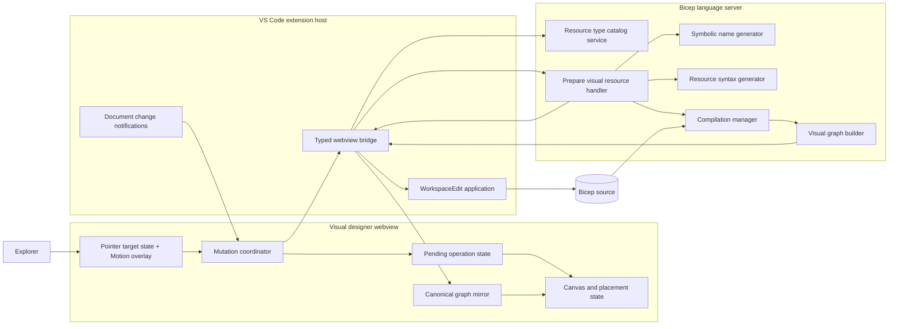
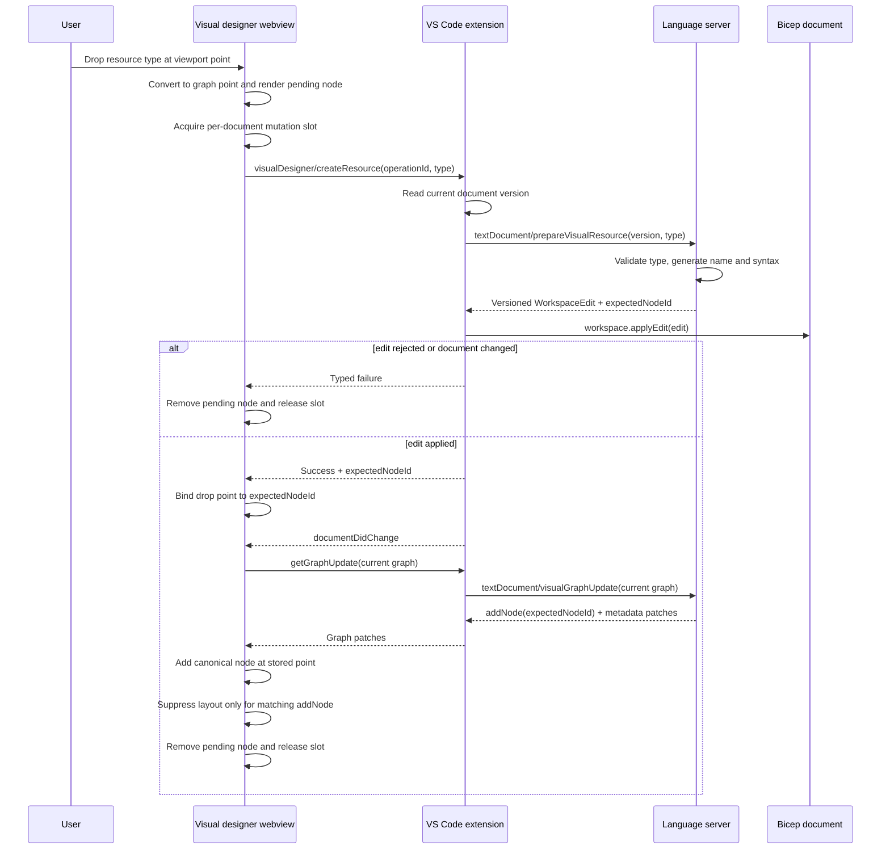

# Visual Designer Resource Creation

## Status

- State: Implemented
- Initial scope: Create a top-level Azure resource by dragging a resource type onto the visual designer canvas
- Related documents:
  - [Visual Graph Protocol](visual-graph-protocol.md)
  - [Visual Designer Architecture Notes](architecture-notes.md)

## Summary

The visual designer exposes a Resource Palette as a collapsible floating island over the full canvas. Pointer-down starts a local pointer drag with an immediate cursor-locked preview. Pointer-up at the canvas coordinate replaces that preview with a centered pending node; the canonical resource node then replaces it at the same center.

The Bicep source file remains the only authoritative representation of the deployment. A pending node is feedback for an in-progress operation, not a second copy of the resource. Resource creation is committed when VS Code successfully applies the source edit. The visual graph then converges from the updated compilation.

The initial implementation will:

- Host a visual-designer-local Resource Palette in a floating island.
- Keep palette presentation, search, and drag initiation within the visual designer feature boundary.
- Put catalog lookup, resource type validation, symbolic name generation, and source generation in the language server.
- Put catalog presentation, drag initiation, coordinate conversion, pending state, and node placement in the visual designer webview.
- Keep the extension host as a typed bridge that applies the language-server-generated `WorkspaceEdit`.
- Preserve every existing node position and avoid layout and fit-view requests for the correlated resource addition.

This approach also establishes a source-mutation pipeline that future visual editing operations can reuse.

## Problem Statement

The visual designer currently renders a read-only projection of the Bicep resource graph. Creating a resource requires leaving the visual context, writing a declaration, and then finding the resulting node after the graph updates and lays itself out.

The first WYSIWYG operation should let a user drag a resource type onto the canvas and create a corresponding declaration while preserving the user's spatial context. The design must avoid creating an independent visual model that can diverge from the source file.

### Current implementation constraints

- The language server builds the canonical graph from the live compilation and returns topology and metadata patches.
- The webview measures nodes and requests layout from the language server.
- An `addNode` patch currently invalidates layout, which normally causes an MSAGL layout request.
- The graph application path preserves surviving node atom identity and positions, but gives an uncorrelated new node a computed default origin.
- The existing `resource-type-explorer` app remains independently runnable and unchanged; it is not a product dependency of the visual designer.
- `InsertResourceHandler` already demonstrates language-server-side syntax construction, formatting, and version-aware source editing patterns that should be factored into reusable services rather than duplicated.
- `SnippetsProvider` already contains schema traversal logic for required resource properties, but its editor tab stops are not valid persisted Bicep source and cannot be inserted directly by this workflow.

## Goals

1. Let a user drag a concrete resource type and API version onto the canvas.
2. Generate and apply a syntactically valid top-level resource declaration.
3. Generate a deterministic, valid, collision-free symbolic name.
4. Place the canonical resource node with its center at the graph coordinate where the user dropped it.
5. Preserve all existing node positions, pan, zoom, and focus.
6. Avoid automatic layout and fit-view for the correlated resource addition.
7. Keep the source editor and visual designer convergent, with source as the authority.
8. Give clear feedback for pending, successful, incomplete, stale, and failed operations.
9. Provide reusable contracts and coordination for future source-mutating visual operations.
10. Remain responsive for large Bicep files and large resource type catalogs.

## Non-goals

The initial iteration will not include:

- Module creation or Azure Verified Module discovery.
- Resource deletion or rename.
- Property editing forms.
- Context menus or quick actions.
- Creating or editing resource relationships.
- Nested resource creation or dropping onto a parent node.
- A custom undo/redo stack.
- Automatic collision avoidance that moves the dropped or existing nodes.
- Persisting manual layout across closing and reopening a visualizer.

VS Code's normal source undo/redo remains available. Undoing the generated edit removes the resource from the canonical graph through the normal graph update path.

## User Experience

### Visual structure

The editing experience will contain:

- A compact "Add Resources" launcher that opens a floating Resource Palette over the canvas.
- The existing pan/zoom canvas in the remaining space.
- Provider/type groups in the palette, with freedom to add custom resource cards, module cards, virtualization, and richer controls.
- A compact error surface for actionable creation failures.

Palette collapse state is local visualizer UI state. The `bicep.visualizer.openPositioning` setting controls editor placement:

- `full`: open in the source editor group.
- `left`: open the visualizer on the left and move the source into a group on the right, creating one when needed.
- `right`: keep the source on the left and open the visualizer on the right.

The implementation uses the public `showTextDocument` API and VS Code's user-facing `workbench.action.moveEditorToRightGroup` command because `ViewColumn.One` alone cannot create a left/right split.

### Interaction flow

1. The user opens the Resource Palette and presses a resource type.
2. The canvas highlights as an available drop target and shows a resource preview.
3. On drop, the webview converts the pointer from viewport coordinates to graph coordinates.
4. A pending node appears immediately at that graph coordinate.
5. The source creation request runs while the pending node displays progress.
6. After the source edit is applied, the visual graph is reconciled from the new compilation.
7. The canonical node replaces the pending node at exactly the same center point.
8. Existing nodes do not move, the viewport does not fit or recenter, and no layout request is sent.
9. If required values could not be inferred, the new node shows its normal error state and the UI reports that the declaration was created but needs source completion.

Dropping outside the canvas cancels the operation without changing the source. Multiple drops are processed serially per document so that generated names and versioned edits cannot race.

### Feedback states

| State                          | Canvas behavior                                   | User feedback                                                   |
| ------------------------------ | ------------------------------------------------- | --------------------------------------------------------------- |
| Dragging                       | Show the resource card centered under the pointer | Cursor-locked preview                                           |
| Preparing edit                 | Keep the identical card at the drop point         | No separate success notification                                |
| Awaiting graph                 | Keep the opaque card in place                     | No separate success notification                                |
| Committed                      | Replace pending node with the canonical node      | Canonical node styling confirms completion                      |
| Created with diagnostics       | Show canonical error state                        | "Resource created; complete required properties in source"      |
| Failed before edit             | Remove pending node                               | Actionable error with retry when safe                           |
| Edit applied but graph delayed | Remove spinner only after a bounded wait          | Warning that source changed but visualization has not caught up |

The last state must not claim that creation failed, because the source edit may already be committed.

## Resource Type Explorer Placement

### Option 1: VS Code side panel

| Consideration            | Assessment                                                                                                                                                        |
| ------------------------ | ----------------------------------------------------------------------------------------------------------------------------------------------------------------- |
| Standard VS Code pattern | Strong. A tree or webview view is discoverable alongside Explorer and other extension views.                                                                      |
| Canvas space             | Strong. It does not reduce the visualizer's panel width.                                                                                                          |
| Reuse across documents   | Strong for browsing, but the active target document and visualizer must be made explicit.                                                                         |
| Drag and drop            | One pointer state machine spans explorer and canvas. The preview position is cursor-locked with no interpolation.                                                 |
| Coordination             | The visualizer owns catalog, drag state, overlay, target detection, coordinates, and pending-node transition.                                                     |
| Maintenance              | Adds another provider/view lifecycle, focus rules, target selection, and cross-view protocol.                                                                     |
| Extensibility            | Strong. React enables custom resource and module cards, search, filtering, favorites, previews, and future module-specific presentations such as thin node cards. |

### Option 2: visual designer webview

| Consideration         | Assessment                                                                                                 |
| --------------------- | ---------------------------------------------------------------------------------------------------------- |
| Integrated experience | Strong. Resource discovery, drag preview, drop target, and result are in one editing surface.              |
| Drag and drop         | Strong. The explorer and canvas share one DOM and one pointer-driven drag state machine.                   |
| Coordinate handling   | Strong. The target can invert the current pan/zoom transform at the exact drop event.                      |
| Target document       | Unambiguous. Each visualizer panel is already bound to one document URI.                                   |
| Canvas space          | Costs horizontal space, mitigated by a collapsible and resizable explorer.                                 |
| Catalog duplication   | Each panel has an explorer view, mitigated by extension/language-server catalog caching.                   |
| Maintenance           | Keeps interaction state within the visual designer feature boundaries described in the architecture notes. |
| Extensibility         | Supports future property palettes and creation tools that need canvas-local state.                         |

### Recommendation

Use the existing React Resource Type Explorer UI in a floating visualizer island. Keep the standalone app as a development shell around the shared UI package.

The extension owns webview hosting, catalog retrieval, and active-target association. The explorer app owns presentation and drag initiation. The visualizer owns drop validation and graph coordinates. This preserves the existing independently runnable React app and provides the UI flexibility required for future resource and module presentation.

## Architecture



### Component responsibilities

| Component                        | Responsibilities                                                                                                                                 | Must not own                                                            |
| -------------------------------- | ------------------------------------------------------------------------------------------------------------------------------------------------ | ----------------------------------------------------------------------- |
| Resource Type Explorer           | React presentation, grouping, selection, future custom node cards, and structured drag payload                                                   | Resource type validation, source text generation, or canvas coordinates |
| Canvas                           | Drop target, coordinate conversion, pending placement, rendering                                                                                 | Bicep syntax or symbolic name selection                                 |
| Mutation coordinator             | Serialize mutations, correlate responses, coordinate graph reconciliation, manage pending/error state                                            | Canonical deployment state                                              |
| Visual graph client              | Pull and apply canonical graph patches, preserve node atoms and positions                                                                        | Source mutations                                                        |
| VS Code extension                | Bind requests to the panel's document, add document version, forward LSP requests, apply `WorkspaceEdit`, surface typed errors, notify the panel | Naming, schema interpretation, layout, or source string construction    |
| Language server catalog service  | Return valid resource type/API version entries for the current compilation and configuration                                                     | Explorer presentation                                                   |
| Language server creation handler | Validate type, compute name, generate syntax, format a versioned edit, report unresolved requirements                                            | Canvas position                                                         |
| Existing visual graph builder    | Rebuild the canonical graph from the updated compilation                                                                                         | Pending UI operations or drop positions                                 |

### Feature organization

The feature should follow the direction in `architecture-notes.md`:

```text
src/
  features/
    resource-palette/
      ResourcePalette.tsx
      ResourcePaletteControls.tsx
      ResourceTypeGroups.tsx
      use-palette-drag.ts
      use-resource-type-search.ts
      atoms.ts
      contracts.ts
    resource-creation/
      PendingResourceLayer.tsx
      ResourceCreationError.tsx
      ResourcePreviewCard.tsx
      atoms.ts
    accessibility/
      MotionAwareProgressBar.tsx
      use-motion-policy-sync.ts
  lib/
    protocol/
      messages.ts
      use-graph-update.ts
```

The generic graph package should accept a new-node origin override, but it should not know what a Bicep resource creation operation is.

The extension adds:

```text
src/
  features/
    visualization/
      resource-palette.ts
```

The existing `apps/resource-type-explorer` React app remains independently runnable, but it does not participate in visual designer resource creation.

## Contract Design

The existing generic webview message channel can remain the transport. New request and response types should be defined once in a shared TypeScript contract module used by both the webview and extension. The C# LSP records mirror the LSP subset.

All new methods are namespaced to avoid collisions and carry an explicit contract version. Unknown versions fail rather than being interpreted optimistically.

### Pointer drag state

The Resource Palette and canvas share one webview, so drag state stays local and does not require a serialized payload. Pointer capture keeps the interaction reliable. The preview uses direct `left`/`top` positioning, so it follows the cursor without delay. Escape cancels. Pointer-up resolves the graph coordinate and swaps the preview for an identical compact pending card at the same center. When the canonical node arrives, its per-node Jotai family atom is set before mount and the real resource card grows from the compact card's 140×42 proportions to its full 220×76 size using the same transition as the Add Resources surface.

### Catalog request

Visual designer webview to extension and language server:

```ts
interface ListResourceTypesRequestV1 {
  version: 1;
  query?: string;
  providerNamespace?: string;
  includePreview: boolean;
  pageSize: number;
  continuationToken?: string;
}

interface ResourceTypeCatalogItemV1 {
  fullyQualifiedType: string;
  apiVersion: string;
  isPreview: boolean;
}

interface ListResourceTypesResponseV1 {
  version: 1;
  items: ResourceTypeCatalogItemV1[];
  continuationToken?: string;
}
```

The visual designer first requests `resourceTypeCatalog/namespaces`. The language server uses the resource provider's cached type index to return provider namespaces and resource-type counts without constructing the complete presentation catalog.

Expanding a provider requests `resourceTypeCatalog/load` with that namespace. The language server lazily constructs and caches the namespace's sorted catalog, selecting the latest stable API version for each resource type. Reopening the provider or requesting later pages reuses that projection.

Search remains global. The first debounced query requests the complete searchable catalog, which intentionally materializes the remaining server-side namespace projections once and returns them to the webview. The webview retains that catalog and filters subsequent queries locally, so follow-up searches do not call the extension or language server. A request-generation guard prevents a slower initial request from replacing a newer query. Matching text is highlighted in provider headers and resource type names.

The palette uses the VSCode Elements progress bar for namespace discovery, lazy provider loading, and the first global search. The extension forwards the effective `workbench.reduceMotion` policy into the webview: `auto` follows the operating system, `on` forces the static reduced-motion presentation, and `off` forces the native VSCode Elements indeterminate animation. Provider-specific failures render inline with a retry action.

### Create request

Webview to extension:

```ts
interface CreateVisualResourceRequestV1 {
  version: 1;
  operationId: string;
  resourceType: {
    fullyQualifiedType: string;
    apiVersion: string;
  };
}

interface CreateVisualResourceResponseV1 {
  version: 1;
  operationId: string;
  expectedNodeId: string;
  symbolicName: string;
  unresolvedRequiredProperties: string[];
}
```

The graph coordinate is deliberately absent. It remains webview-local and is stored against `operationId` until the response supplies `expectedNodeId`.

Extension to language server:

```ts
interface PrepareVisualResourceParams {
  textDocument: VersionedTextDocumentIdentifier;
  operationId: string;
  resourceType: {
    fullyQualifiedType: string;
    apiVersion: string;
  };
}

interface PrepareVisualResourceResult {
  operationId: string;
  expectedNodeId: string;
  symbolicName: string;
  unresolvedRequiredProperties: string[];
  edit: WorkspaceEdit;
}
```

The `WorkspaceEdit` uses a `TextDocumentEdit` with the requested document version. VS Code rejects it if the document changes before application. The extension returns success to the webview only after `workspace.applyEdit` reports success.

Returning an edit instead of having the language server initiate `workspace/applyEdit` keeps the source commit under the extension request that originated it, gives the bridge precise success/failure ordering, and makes the handler easier to test.

### Errors

Expected failures use typed error codes:

```ts
type CreateVisualResourceErrorCode =
  | "unsupportedContract"
  | "invalidResourceType"
  | "documentChanged"
  | "documentReadOnly"
  | "editRejected"
  | "generationFailed";

interface CreateVisualResourceErrorV1 {
  version: 1;
  operationId: string;
  code: CreateVisualResourceErrorCode;
  message: string;
  retryable: boolean;
}
```

The extension maps LSP and workspace errors to this small webview-facing set and logs the underlying technical detail through existing extension logging. It must not return an empty edit or success-shaped fallback.

### Standalone explorer boundary decision

The visual designer reuses the concepts of provider groups and concrete `{ resourceType, apiVersion }` entries, but not the standalone explorer's components or native HTML drag behavior. Keeping the Resource Palette local avoids a package boundary with no second product consumer. The existing explorer app remains independent.

The webview request remains intentionally small and presentation-oriented, while the extension-to-language-server contract remains flat, paged, and document-aware.

The Resource Palette reuses the shared Accordion component. The Accordion supports controlled multiple expansion, native button semantics, linked header/panel ARIA attributes, and keyboard movement between headers. Panels expand immediately rather than animating height, which avoids clipping partially rendered large groups. During global search the palette controls expansion from matching groups; clearing search restores the user's prior browsing expansion.

## Source Generation

### Validation

The language server must:

1. Resolve the requested document to the current entrypoint compilation.
2. Verify the requested version matches the document version represented by the edit.
3. Resolve the exact type and API version through the document's active Azure namespace resource type provider.
4. Reject unknown, unavailable, or unsupported extensibility resource types in the initial release.
5. Verify the target is a writable Bicep source document.
6. Treat every webview string as untrusted input and never interpolate it directly into source.

### Symbolic name generation

The initial name is derived from the final resource type path segment:

1. Take the final segment, for example `storageAccounts`.
2. Apply conservative singularization, producing `storageAccount`.
3. Convert to camel case.
4. Replace invalid identifier characters and ensure `Lexer.IsValidIdentifier` succeeds.
5. Fall back to `resource` if no useful identifier remains.
6. Compare against all top-level declared symbols using Bicep's case-insensitive identifier comparer.
7. If occupied, append the smallest available numeric suffix beginning at `1`.

Examples:

```text
storageAccount
storageAccount1
storageAccount2
```

The generator must be a dedicated, unit-tested language server service. It may reuse an existing identifier sanitization utility if dependency direction permits, but it must not depend on decompiler-only state.

### Resource declaration

The declaration is built with Bicep syntax APIs and formatted with the document's configured formatter:

```bicep
resource storageAccount 'Microsoft.Storage/storageAccounts@2025-01-01' = {
}
```

The generator adds a property only when its value is deterministic from the schema or deployment context. Examples include a required discriminator with one legal literal value or another compiler-verified contextual expression. It does not insert:

- Sample names, SKUs, IDs, secrets, endpoints, or locations.
- Snippet tab stops such as `$1`.
- `null`, empty strings, or dummy identifiers merely to suppress diagnostics.

Some resource types cannot be semantically complete without user decisions. For those types, an empty or partially inferred body is preferable to invented configuration. It is syntactically valid, and `unresolvedRequiredProperties` tells the UI which required properties still need source editing. The normal compiler diagnostics and node error state remain authoritative.

The schema traversal used by `SnippetsProvider` should be extracted or reused for identifying required properties, while persisted source generation remains separate from editor snippet generation.

### Insertion and formatting

The initial implementation inserts the declaration one blank line after the last resource declaration. If the file has no resource declaration, it inserts after top-level preamble declarations, parameters, and variables, and before modules and outputs. If the file starts with an output, the resource is inserted at the beginning. Existing comments and whitespace following the insertion anchor remain attached to the following declaration.

Reusable insertion and printing logic should be extracted from `InsertResourceHandler`:

- Determine a safe top-level insertion span.
- Construct syntax with `SyntaxFactory`.
- Run required casing and read-only-property rewriters.
- Print with `PrettyPrinterV2`.
- Parse the generated replacement before returning it.
- Return a versioned `WorkspaceEdit` instead of raw text to the webview.

The edit does not save the document. It participates in VS Code's native dirty-file and undo/redo behavior.

## Drag, Commit, and Reconciliation Workflow



### Operation coordination

The webview uses one mutation queue per visualizer document:

- Only one source mutation is prepared or reconciled at a time.
- `documentDidChange` notifications received during creation set the graph client's existing dirty flag.
- The graph update loop does not consume the creation's `addNode` patch until the create response has bound `expectedNodeId` to the drop point.
- After binding, the queued graph update runs and the existing single-in-flight convergence loop handles additional source changes.

This prevents the graph patch from arriving before the webview knows which new node owns the drop point. It also prevents two simultaneous drops from selecting the same symbolic name or applying edits against the same document version.

`operationId` is for correlation and diagnostics, not for source identity. The top-level symbolic name is the expected node ID under the current visual graph builder.

## Synchronization and Consistency

### Source is the commit

No distributed two-phase commit is needed. There is only one durable state transition: applying the versioned source edit.

The pending node is a transient projection with these rules:

- It never enters the canonical graph mirror sent to the language server.
- It cannot create dependency edges.
- It cannot be selected for source reveal or future edit commands.
- It disappears on pre-commit failure.
- It is replaced only by a canonical node with the expected ID.

This is closer to an optimistic UI around a single source transaction than to two-phase commit. Adding a second commit for visual state would create failure and rollback cases without improving source correctness.

### Convergence

After the edit:

1. The extension emits `documentDidChange` for the panel's document.
2. The visual graph client requests a delta against the graph it currently renders.
3. The language server builds the graph from the latest available compilation.
4. If compilation has not caught up, the existing dirty/single-flight mechanism retries after the next document or diagnostics notification.
5. The operation commits visually only when the expected canonical node appears.

The extension should observe text document changes directly for open visualizer documents rather than relying only on diagnostic publication. Diagnostic timing is an implementation detail and may not change for every source edit.

### Stale and concurrent edits

- The returned `TextDocumentEdit` carries the source version used to prepare it.
- If the user types before application, VS Code rejects the edit and the UI offers a safe retry.
- The UI does not automatically retry a source mutation because doing so without observing the final document could create a duplicate.
- If an external edit creates the expected symbolic name first, a fresh prepare request generates the next suffix.
- If the user undoes the creation before graph reconciliation, the expected node never appears; the pending operation is canceled as superseded rather than reported as a source failure.

## Node Placement and Layout Preservation

### Coordinate conversion

At drop time, the canvas converts the pointer to graph coordinates:

```text
graphX = (clientX - canvasLeft - panX) / zoom
graphY = (clientY - canvasTop  - panY) / zoom
```

The stored point is the desired node center. This matches the existing atomic node behavior, which expands a zero-size origin around its center on first measurement.

Coordinates are validated as finite numbers and clamped only to a broad safe numeric range. They are not snapped or collision-adjusted in the initial iteration because the exact drop location takes precedence.

### Applying the graph patch

The graph application API gains an optional map of `nodeId -> origin` for newly added atomic nodes. For the correlated `addNode` patch:

1. Use the stored drop point instead of the default viewport center or existing-node centroid.
2. Preserve existing node atoms and boxes.
3. Mark layout visibility ready after the new node is measured.
4. Consume the placement entry exactly once.

The resource-palette feature owns the placement map. Generic graph code only understands an optional origin override.

### Suppressing layout

The current client treats every `addNode` as layout-affecting. The invalidation check will accept a set of explicitly placed node IDs:

- `addNode` for the expected, pending resource is non-layout-affecting.
- Other patches retain their existing invalidation behavior.
- Metadata and error-count patches remain non-layout-affecting as today.
- A concurrent unrelated topology change can still request layout; it is not incorrectly hidden by the creation operation.

A successful correlated insertion therefore sends no `getGraphLayout` request and does not run fit-view. The explicit Reset Layout command continues to lay out the entire graph and may move the manually placed node.

The initial iteration preserves positions for the lifetime of the visualizer panel. Persistence across panel recreation is a separate layout-metadata feature and must not be encoded in Bicep declarations or added to the canonical language-server graph.

## Error Handling and Edge Cases

| Case                                         | Required behavior                                                                                          |
| -------------------------------------------- | ---------------------------------------------------------------------------------------------------------- |
| Unknown or stale drag payload                | Reject before source request; show a concise error                                                         |
| Resource type or API version unavailable     | Remove pending node; explain that the type is unavailable for the current document                         |
| Preview types disabled                       | Keep item out of default results; reject forged payloads server-side                                       |
| Read-only or virtual document                | Disable drop target when known and reject at commit if state changed                                       |
| Document changes during preparation          | Versioned edit fails; offer retry without automatic duplication                                            |
| Workspace edit rejected                      | Remove pending node; preserve source and graph                                                             |
| Generated text does not parse                | Return `generationFailed`; never apply partial text                                                        |
| Required values cannot be inferred           | Apply syntactically valid declaration; return unresolved property names and rely on diagnostics            |
| Existing source has diagnostics              | Allow creation if the entrypoint and requested type can still be resolved; never hide existing diagnostics |
| Compilation update is delayed                | Keep synchronization state; coalesce notifications and retry graph pull                                    |
| Edit applied but expected node never appears | Warn that source changed but visualization is stale; provide Refresh and Reveal Source actions             |
| User drops on an existing node               | Treat as a canvas coordinate in the initial release; do not infer parent or relationship                   |
| Drop overlaps another node                   | Keep exact drop position                                                                                   |
| Multiple fast drops                          | Queue per document and generate each name from the latest applied source                                   |
| Visualizer closes mid-operation              | Let an already accepted workspace edit finish; dispose pending UI and do not reopen the panel              |
| Explicit Reset Layout during creation        | Queue it after reconciliation so layout and placement cannot race                                          |

Technical errors are logged with operation ID and method name. User-facing messages exclude stack traces and source content.

## Performance and Scalability

### Interaction

- Render the pending node in the next animation frame without waiting for the extension or language server.
- Keep drag move handling local and avoid React-wide state updates on every pointer event.
- Read the pan/zoom transform once at drop, not continuously through the source operation.
- Update only the new node and localized status state.

### Catalog

- Query and page in the language server; cap page size.
- Cache catalog results by active namespace configuration, feature flags, query, and preview policy.
- Prefer the latest stable API version in default results while allowing explicit version expansion.
- Virtualize long provider/type lists.
- Cancel obsolete searches as the user changes the filter.
- Do not serialize schema bodies or required-property trees into the explorer catalog response.

### Source and graph

- Reuse the current compilation and resource type provider.
- Build and format one declaration, not the entire source file.
- Rely on the existing debounced document notification and one-in-flight graph update loop.
- Do not request MSAGL layout or fit-view for the correlated addition.
- Do not send canvas coordinates, pending nodes, or the full resource catalog through graph update requests.

Proposed instrumentation should separately measure time to pending feedback, catalog query latency, edit preparation, workspace edit application, and canonical graph reconciliation. Release criteria should be based on measured representative small and large templates rather than one aggregate duration.

## Security and Privacy

- Treat webview messages and palette item data as untrusted.
- Enforce contract versions, input length limits, page-size limits, and finite coordinates.
- Resolve resource types against the language server's catalog; never use a payload as raw source text.
- Bind all operations to the visualizer panel's document URI in the extension. The webview cannot choose an arbitrary file.
- Apply edits only to the versioned, open Bicep entry document.
- Retain the visualizer's existing Content Security Policy and do not add remote scripts or direct catalog network access from the webview.
- Do not read Azure credentials or resource instances. The catalog comes from Bicep type definitions.
- Do not emit source text, resource property values, document paths, or drag coordinates in telemetry.
- Limit telemetry to operation outcome, normalized resource type where policy permits, duration buckets, and non-sensitive error codes.

No new authentication or authorization flow is required.

## Testing and Validation

### Language server unit tests

- Resource type and API version validation.
- Symbolic naming, singularization, invalid characters, reserved-looking names, casing, and numeric suffix gaps.
- Deduplication against every top-level symbol kind using Bicep identifier comparison.
- Required-property inference and unresolved-property reporting.
- Parser-valid syntax generation for representative resource body shapes.
- Configured newline and formatter behavior.
- Versioned `WorkspaceEdit` range and insertion behavior for empty, valid, and already-invalid files.
- Cancellation and typed failure results.

### Webview unit tests

- Structured MIME payload encoding and validation.
- Viewport-to-graph coordinate conversion at multiple pan/zoom values.
- Pending operation state transitions.
- Per-document mutation serialization.
- Binding `operationId` to `expectedNodeId`.
- Applying an origin override exactly once.
- Suppressing layout for only the matching `addNode`.
- Preserving layout invalidation for unrelated topology patches.
- Cleanup on rejection, supersession, timeout, and disposal.

### Extension tests

- Document URI and version binding.
- Protocol conversion for catalog and prepare requests.
- Applying a versioned workspace edit.
- Mapping LSP/workspace failures to typed webview errors.
- Ordering create response and document-change notification.
- Closing a visualizer during an in-flight request.

### End-to-end tests

Playwright coverage in the visual designer:

1. Drag a storage account at zoom `1` and verify its center.
2. Repeat while panned and zoomed.
3. Verify all existing node boxes are unchanged.
4. Verify no layout or fit-view request is sent.
5. Verify the pending node becomes the canonical node.
6. Verify duplicate types produce `storageAccount`, `storageAccount1`, and `storageAccount2`.
7. Verify failures remove pending UI and preserve the graph.
8. Verify explicit Reset Layout still works after creation.

Language-server/extension integration coverage should verify that the generated declaration is inserted, is parser-valid, participates in native undo, and produces the expected visual graph node ID.

### Performance validation

Measure:

- Drag responsiveness with a large rendered graph.
- Catalog filtering with a large type catalog.
- Creation and reconciliation in a large Bicep file.
- Render counts for surviving nodes.
- Absence of a visual graph layout request for the correlated addition.

## Dependencies and Prerequisites

- Existing visual graph update and layout protocol.
- Existing webview request/notification channel.
- Pan/zoom transform access in `@vscode-bicep-ui/components`.
- Bicep compilation manager and Azure resource type provider.
- Bicep syntax factory, rewriters, formatter, and parser.
- Required-property schema traversal currently used by language server snippets.
- VS Code versioned `WorkspaceEdit` and native undo/redo.

No external service, Azure subscription, or network call is required.

## Rollout Plan

1. Extract reusable language-server insertion, formatting, and required-property inspection services.
2. Add typed catalog and prepare-resource LSP contracts with unit tests.
3. Extract the explorer UI into a reusable package and host it in a floating visualizer island.
4. Add pointer-driven dragging, a Motion overlay, pending operation state, and coordinate conversion.
5. Add versioned edit application and mutation/graph-update coordination in the extension and webview.
6. Add origin overrides and correlated layout suppression.
7. Add unit, extension, integration, and Playwright coverage.
8. Release behind the visual designer's experimental feature gate, collect non-sensitive outcome and latency metrics, and then enable by default when reliability targets are met.

## Future Extensibility

The source-mutation request pipeline can support:

- Delete: prepare a versioned declaration-removal edit and reconcile a `removeNode` patch.
- Rename: use language-server symbol rename and correlate old/new node IDs.
- Property editing: prepare focused syntax edits while continuing to render from compilation.
- Relationship editing: create expression or `dependsOn` edits, then reconcile canonical edges.
- Nested resources: include a target parent ID and let the language server choose nested versus `parent` syntax.
- Modules and AVM: add separate catalog item kinds, custom React presentations such as thin module nodes, and creation handlers without changing graph placement primitives.
- Favorites, filtering, and module cards without changing catalog services.
- Layout persistence: store user placement metadata outside Bicep source, keyed by document identity and stable node identity.

Each operation should preserve the same invariant: source mutation is the only durable commit, and the visual graph is accepted only from the resulting compilation.

## Key Decisions

| Decision                                                           | Rationale                                                                                                           |
| ------------------------------------------------------------------ | ------------------------------------------------------------------------------------------------------------------- |
| Use a floating same-webview island and pointer drag                | Preserves full canvas space when closed, avoids VS Code drag interception, and enables rich cursor-locked animation |
| Configure placement with `bicep.visualizer.openPositioning`        | Mirrors `workbench.editor.openPositioning` with visualizer-relative values: `full`, `left`, and `right`             |
| Retain the explorer request and replace its backing implementation | Preserves the independently runnable app while making the catalog document-aware and language-server-backed         |
| Keep catalog and generation in the language server                 | They depend on compilation configuration, namespace providers, syntax, and Bicep naming rules                       |
| Return a versioned `WorkspaceEdit` to the extension                | One explicit source commit, native undo, stale-edit protection, and testable generation                             |
| Keep drop coordinates in the webview                               | Layout is presentation state and does not belong in source or the canonical graph                                   |
| Use a pending node instead of optimistic canonical mutation        | Immediate feedback without creating a second source of truth                                                        |
| Do not use two-phase commit                                        | There is one durable store; graph reconciliation is a projection, not a second commit                               |
| Suppress layout by correlated node ID                              | Meets position preservation without disabling valid layout for unrelated changes                                    |
| Insert only deterministic property values                          | Avoids fabricated configuration and credentials while preserving syntax validity                                    |
| Serialize mutations per document                                   | Prevents stale versions, duplicate names, and reconciliation races                                                  |

## Risks and Mitigations

| Risk                                                          | Mitigation                                                                                              |
| ------------------------------------------------------------- | ------------------------------------------------------------------------------------------------------- |
| Compilation lags behind the applied edit                      | Existing dirty-loop convergence plus direct text-document notifications                                 |
| A graph patch arrives before the create response              | Share a mutation/reconciliation coordinator and defer graph consumption until node ID binding           |
| Required properties make the declaration semantically invalid | Insert only deterministic values, report unresolved properties, and rely on normal diagnostics          |
| Explorer catalog is too large                                 | Search, paging, caching, and list virtualization                                                        |
| A resource node ID changes in future graph protocols          | Treat `expectedNodeId` as a language-server result rather than recomputing it in the webview            |
| Concurrent user typing rejects the edit                       | Versioned edit and explicit retry                                                                       |
| Manual placement is lost after reopening                      | Document as initial non-goal and design a separate layout persistence mechanism                         |
| Pointer dragging grows beyond palette-to-canvas needs         | Keep a library-neutral feature API and move reusable behavior into `packages/components` when justified |
| Multiple visualizers make the catalog target ambiguous        | Bind catalog configuration to the active visualizer and label/refresh when that target changes          |

## Open Questions

1. Which deterministic required values beyond singleton discriminator literals are safe enough to generate across deployment scopes?
2. Should default catalog results show only the latest stable API version, or also the latest preview when no stable version exists?
3. Should resource type filtering include configured extension namespaces in the first release, or Azure types only?
4. What warning duration and recovery actions should be used when an applied source edit does not appear in the graph?
5. Is panel-lifetime placement sufficient for the first release, or should webview-state persistence be included before preview?

These questions do not change the ownership boundaries or source-of-truth model and can be resolved during implementation planning.

## Success Criteria

The feature is ready for the initial release when:

- A user can drag a supported Azure resource type onto the visual designer.
- The extension applies a parser-valid resource declaration to the bound Bicep document.
- The language server generates a deterministic, deduplicated symbolic name.
- The canonical node appears with its center at the exact graph-space drop point.
- Existing node positions, pan, zoom, and focus remain unchanged.
- The correlated addition sends no automatic layout or fit-view request.
- Source edits, undo, and external editor changes converge through the canonical visual graph.
- Failures never leave an uncommitted canonical node or report false source success.
- The UI and language server responsibilities are enforced by typed, versioned contracts.
- Tests cover source generation, coordination races, placement, layout suppression, and end-to-end creation.
