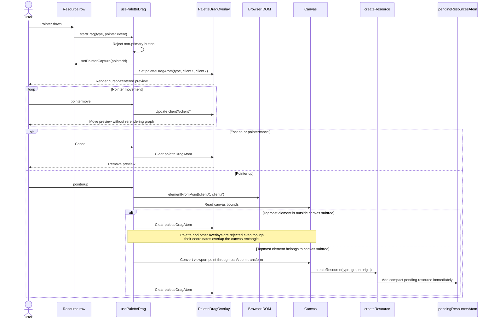
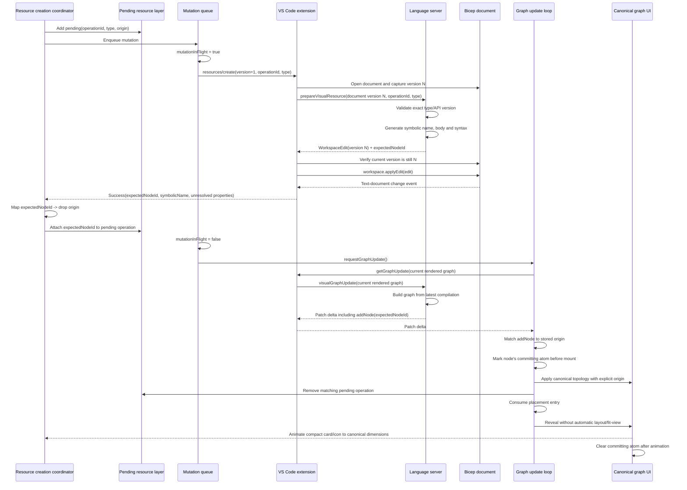
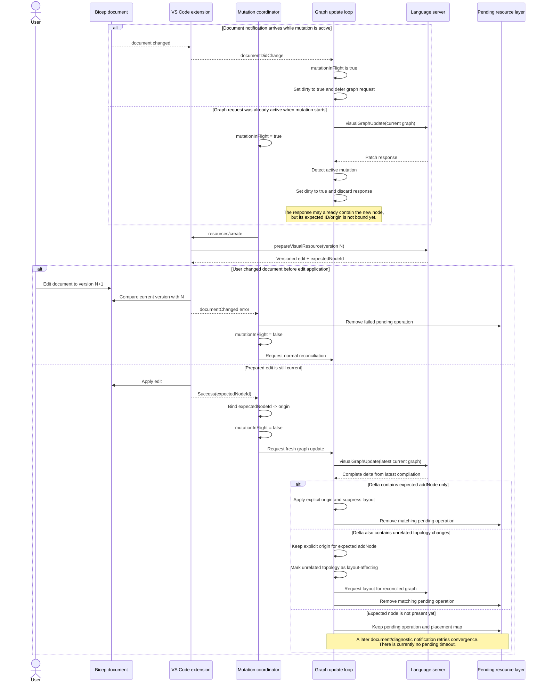
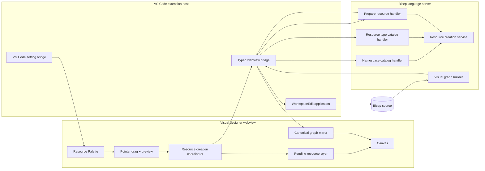

# Visual Designer Resource Creation

## Status

- State: Implemented behind a VS Code experimental setting
- Scope: Create a top-level Azure resource by dragging or keyboard-activating a resource type from the Resource Palette
- Source of truth: The Bicep source file
- Related documents:
  - [Visual Graph Protocol](visual-graph-protocol.md)
  - [Visual Designer Architecture Notes](architecture-notes.md)

## Enablement

Resource creation is disabled by default. Enable it in VS Code settings:

```json
"bicep.visualizer.experimental.enableResourceCreation": true
```

When disabled, the visual designer does not render the **Add Resources** launcher. Changing the setting updates open visualizer panels without requiring a reload. This is a VS Code extension setting, not a `bicepconfig.json` compiler feature.

The existing `bicep.visualizer.openPositioning` setting independently controls editor placement:

- `full`: open in the source editor group
- `left`: open the visualizer left of the source
- `right`: open the visualizer right of the source

## User Experience

The visual designer contains a collapsible floating **Resource Palette** over the full canvas:

- The collapsed launcher uses the library icon and the same control primitives as the visualizer toolbar.
- Opening and closing the palette does not resize the canvas.
- The search box and progress bar remain sticky while resource groups scroll.
- Provider groups use the shared accessible Accordion.
- Scrollbars use VS Code scrollbar theme tokens.
- API versions are shown in palette rows but omitted from drag and pending previews.

### Lazy browsing

Opening the palette loads only Azure resource-provider namespaces and their resource-type counts. Expanding a provider:

1. Rotates the disclosure caret immediately.
2. Starts a namespace-specific catalog request if that namespace is not cached.
3. Shows the shared progress bar while the request is active.
4. Fades and slides the complete list into view after it loads.

Collapsing and reopening a loaded provider does not reload it.

### Global search

Search remains global even though normal browsing is lazy:

1. Input is debounced by 250 ms.
2. The first non-empty search requests the complete searchable catalog.
3. The language server materializes any remaining namespace projections once.
4. The webview caches the returned catalog.
5. Subsequent searches filter the webview cache and do not call the extension or language server.

A request-generation guard prevents an older initial search response from replacing a newer query. Matching text is highlighted in provider headers and resource type names. Search expansion is controlled separately from browsing expansion, so clearing the query restores the user's previous browsing state.

### Drag and keyboard creation

Pointer-down on a resource row starts a local Pointer Events drag:

- The preview appears immediately and stays centered under the pointer.
- Pointer capture keeps the interaction in one webview.
- Escape cancels the drag.
- The preview subscribes directly to pan/zoom state so its size remains aligned with the transformed canvas.
- Pointer-up is accepted only when the topmost DOM element under the pointer belongs to the canvas subtree.

The final hit-test is important because the floating palette overlays the canvas rectangle. Dropping over the palette or another non-canvas overlay cancels creation even though the coordinates are geometrically inside the canvas bounds.

Pressing Enter or Space on a resource row creates it at the current viewport center.

### Creation feedback

After an accepted drop:

1. The viewport point is converted to graph coordinates.
2. An opaque compact pending card appears at that center.
3. The source mutation is queued.
4. The extension applies the language-server-generated edit.
5. A document-change notification triggers graph reconciliation.
6. The canonical resource node mounts at the stored center.
7. The pending card is removed.
8. The canonical card and icon grow from preview dimensions to normal node dimensions.

Preview and pending cards are intentionally identical. There is no opacity, border, API-version, or spinner difference because the pending period is usually short and those changes produced visible flashing.

Creation failures remove the pending card and show a dismissible error surface. Required properties that cannot be generated are left to normal compiler diagnostics; the current UI does not show a separate unresolved-properties notification.

## Detailed Interaction Sequences

### Pointer drag and drop acceptance



Pointer capture is used for interaction continuity, but it is not used as proof that the final pointer location is a valid target. The final DOM hit-test decides whether the drop is accepted.

### Successful source commit and pending-node reconciliation



`workspace.applyEdit` is the durable commit. The pending card is removed only when the graph delta contains the expected canonical node, not merely when the extension reports that the edit was applied.

### Concurrent document changes and graph requests



The interlock preserves three invariants:

1. A canonical `addNode` is never consumed before its expected node ID is associated with the drop origin.
2. A source edit is never applied after its prepared document version becomes stale.
3. Suppressing layout for the explicitly placed resource never suppresses layout required by unrelated concurrent topology changes.

## Architecture



### Ownership

| Area | Owns | Does not own |
|---|---|---|
| Resource Palette | Namespace presentation, search, lazy loading state, resource rows, drag initiation and preview | Source generation, pending mutation state, canonical graph |
| Resource creation | Pending/error/committing state, compact preview card, creation transition | Catalog browsing or canonical deployment state |
| Visual graph client | Canonical graph patches, node identity, position preservation and layout invalidation | Source mutation UI |
| Extension | Document binding, VS Code settings, LSP forwarding, edit application and webview responses | Bicep syntax generation or graph coordinates |
| Language server | Catalog indexing, exact type validation, symbolic naming, syntax generation and versioned edits | Palette presentation or canvas placement |

### Visual designer feature organization

```text
src/features/
  accessibility/
    MotionAwareProgressBar.tsx
    use-motion-policy-sync.ts
  resource-creation/
    animations.ts
    atoms.ts
    PendingResourceLayer.tsx
    ResourceCreationError.tsx
    ResourcePreviewCard.tsx
  resource-palette/
    PaletteDragOverlay.tsx
    ResourcePalette.tsx
    ResourcePaletteControls.tsx
    ResourcePaletteLayer.tsx
    ResourceTypeGroups.tsx
    atoms.ts
    contracts.ts
    use-palette-drag.ts
    use-resource-creation-enablement.ts
    use-resource-type-search.ts
```

The generic graph package accepts new-node origin overrides but has no knowledge of resource creation operations. The standalone `apps/resource-type-explorer` remains independent and is not a product dependency of the visual designer.

## Resource Catalog

### Language-server contracts

The initial namespace request returns a catalog identity plus provider counts:

```csharp
record VisualResourceTypeNamespacesResult(
    string CatalogId,
    IReadOnlyList<VisualResourceTypeNamespace> Namespaces);

record VisualResourceTypeNamespace(
    string Name,
    int ResourceTypeCount);
```

Resource type requests support one provider or a global query and remain paged:

```csharp
record VisualResourceTypesParams(
    TextDocumentIdentifier TextDocument,
    string? ProviderNamespace,
    string? Query,
    bool IncludePreview,
    int PageSize,
    string? ContinuationToken);

record VisualResourceTypesResult(
    string CatalogId,
    IReadOnlyList<VisualResourceTypeCatalogEntry> Items,
    string? ContinuationToken);
```

The extension validates that every page has the same catalog identity before returning grouped webview results.

### Caching

The Azure resource type provider already exposes a lazy `TypeReferencesByType` index. The resource creation service builds on that index:

- A `ConditionalWeakTable` keys catalog indexes by provider identity.
- The index contains immutable provider-namespace groups.
- Each namespace has thread-safe `Lazy<ImmutableArray<...>>` projections for stable-only and preview-inclusive results.
- The latest allowed API version is selected once per resource type with `ApiVersionComparer`.
- Stable versions win over same-date preview versions.
- Global query results use a bounded normalized-query cache.

The built-in provider is process-lifetime, so its cache is effectively process-lifetime. Dynamically loaded provider instances have separate indexes.

The normal palette requests stable versions only. Preview entries are supported by the protocol/service but are not exposed by the current palette UI.

## Source Creation

### Webview request

```ts
interface CreateVisualResourceRequest {
  version: 1;
  operationId: string;
  resourceType: {
    fullyQualifiedType: string;
    apiVersion: string;
  };
}

interface CreateVisualResourceResponse {
  version: 1;
  operationId: string;
  expectedNodeId: string;
  symbolicName: string;
  unresolvedRequiredProperties: string[];
}
```

The graph coordinate is deliberately absent. It remains webview-local and is correlated first by `operationId`, then by `expectedNodeId`.

### Language-server preparation

Each JSON-RPC handler is in its own file:

- `VisualResourceTypeNamespacesHandler`
- `VisualResourceTypesHandler`
- `PrepareVisualResourceHandler`

The prepare handler:

1. Resolves the active compilation.
2. Verifies the target is a Bicep file.
3. Validates the exact resource type and API version with the Azure provider.
4. Generates a deterministic symbolic name.
5. Generates deterministic body properties.
6. Builds and formats Bicep syntax.
7. Self-validates the generated declaration for lexer/parser errors.
8. Returns a versioned `WorkspaceEdit`.

### Symbolic naming

The base name comes from the final resource type segment:

1. Apply conservative singularization.
2. Convert the first character to lower case.
3. Remove characters that cannot participate in a Bicep identifier.
4. Fall back to `resource` if the result is invalid or empty.
5. Compare with all top-level declaration names case-insensitively.
6. Append the smallest available positive numeric suffix on collision.

Examples:

```text
storageAccount
storageAccount1
storageAccount2
```

### Resource body

Only compiler-known deterministic values are emitted:

- A required property with a `StringLiteralType` receives that literal.
- Other required properties are returned through `unresolvedRequiredProperties`.
- Discriminated object bodies report the discriminator as unresolved.

The generator does not invent names, locations, SKUs, IDs, secrets, empty strings, nulls or snippet tab stops.

### Insertion and formatting

The declaration is inserted:

- One blank line after the last resource declaration, or
- After preamble declarations, parameters and variables when no resource exists, or
- At the beginning when modules/outputs are the first declarations.

Insertion preserves comments and whitespace attached to following declarations. Generated syntax runs through the casing and read-only-property rewriters, `PrettyPrinterV2`, and parser self-validation. The edit does not save the document and participates in native dirty-file and undo/redo behavior.

## Commit and Reconciliation

The source edit is the only durable commit. Pending visual state is optimistic feedback, not a second model.

The webview serializes creation mutations:

- A new operation receives a UUID and pending placement.
- Only one prepare/apply mutation runs at a time.
- Graph-update requests that complete while a mutation is active are discarded and retried after the expected node ID is known.
- The create response binds the expected canonical node ID to the drop origin.
- The next graph delta places that node at the stored origin.

The extension performs an explicit document-version check immediately before `workspace.applyEdit`. This is required because converting the LSP `WorkspaceEdit` to the VS Code representation does not preserve the LSP document-version guard.

If the edit is rejected or the document version changed, the webview removes the pending resource and displays an error. It does not automatically retry, which avoids accidental duplicate creation.

## Placement and Layout

Viewport coordinates are converted to graph coordinates using the current canvas bounds and pan/zoom transform:

```text
graphX = (clientX - canvasLeft - panX) / zoom
graphY = (clientY - canvasTop  - panY) / zoom
```

The stored point is the desired node center.

For the correlated `addNode` patch:

- The new node receives the explicit origin.
- Existing node atoms and boxes are preserved.
- The placement entry is consumed once.
- The addition is excluded from automatic layout invalidation.
- No fit-view request runs.

Unrelated topology changes still invalidate layout normally. Explicit **Reset Layout** may later move the manually placed resource.

Placement persists for the lifetime of the visualizer panel only. It is not written into Bicep source or the canonical graph protocol.

## State and Performance

Jotai is used where subscription isolation matters:

- Pointer drag state rerenders only the drag overlay.
- Namespace atoms rerender only the loading provider group.
- Pending/error state belongs to resource creation surfaces.
- Per-node committing atoms rerender only the newly committed resource.

Local React state remains appropriate for palette open state, search query and controlled Accordion expansion.

Other performance choices:

- Namespace browsing avoids building the full presentation catalog.
- The first global search caches the full searchable catalog in the webview.
- Subsequent searches are local.
- Pointer movement never rerenders the graph subtree.
- Azure SVG imports are cached per normalized resource type with `jotai-family`.
- Source generation formats one generated declaration, not the complete source file.
- Correlated creation avoids MSAGL layout and fit-view.

Long resource lists are not virtualized in the current implementation.

## Motion and Accessibility

The shared Accordion provides:

- Native button headers
- Controlled single/multiple expansion
- `aria-expanded`, `aria-controls`, `aria-labelledby` and region semantics
- Arrow Up/Down, Home and End focus navigation
- DOM-order-aware keyboard movement after group reordering

Accordion panels remain mounted and reveal immediately. Newly loaded resource rows use a short 160 ms fade/slide transition instead of height animation, which avoids clipping partially visible large groups.

The progress component lives in `@vscode-bicep-ui/components` and renders the VSCode Elements progress bar. The extension forwards the effective `workbench.reduceMotion` policy:

- `auto` leaves VSCode Elements to follow the operating system.
- `on` forces the static reduced-motion presentation.
- `off` forces the same indeterminate keyframes used by VSCode Elements even when Windows animations are disabled.

The setting bridge updates open visualizers at runtime.

## Errors and Current Limitations

| Case | Current behavior |
|---|---|
| Resource creation setting disabled | Hide the Add Resources launcher |
| Namespace-list load fails | Show a top-level retry action |
| Namespace load fails | Show an inline retry action in that group |
| Search load fails | Show an inline search error |
| Drop outside the canvas DOM subtree | Cancel without a source change |
| Exact type/API version unavailable | Remove pending state and show an error |
| Document changes before edit application | Reject as `documentChanged` |
| Workspace edit rejected | Remove pending state and show an error |
| Generated declaration fails parsing | Return a generation failure and apply nothing |
| Required properties cannot be generated | Apply the declaration and rely on compiler diagnostics |
| Existing source contains diagnostics | Allow creation when compilation/type resolution still succeeds |
| Multiple fast drops | Serialize them |
| Visualizer closes during an operation | Dispose visual state; do not reopen the panel |

There is currently no pending-operation timeout or special warning when an applied edit never produces the expected graph node. There is also no separate unresolved-required-properties notification, list virtualization, layout persistence or creation telemetry.

## Security and Privacy

- Webview data is treated as untrusted.
- Resource types are validated against the active language-server provider.
- The extension binds operations to the visualizer's document; the webview cannot select an arbitrary file.
- Source strings are generated through syntax APIs, not interpolated from the webview payload.
- Page sizes are clamped server-side.
- The webview performs no catalog network access.
- No Azure credentials or live resource instances are read.
- No source text, property values, paths or coordinates are emitted as telemetry.

## Validation

Implemented coverage includes:

- Language-server unit tests for naming, body generation, catalog namespaces, latest-version selection, paging, filtering and insertion.
- Language-server integration tests for namespace/catalog requests, preparation, collisions, unresolved discriminators and unknown types.
- Shared component tests for Accordion single/multiple/controlled behavior, ARIA state and keyboard navigation.
- Extension unit tests for visualizer placement, catalog grouping, edit failure classification and motion-policy mapping.
- Visual-designer unit tests for graph layout invalidation and per-node committing atom isolation.
- Playwright tests for:
  - Experimental setting disabled
  - Palette open/close without canvas resizing
  - Zoomed preview/pending center and size alignment
  - Lazy global search, progress and match highlighting
  - Cached follow-up search
  - Drop rejection over the Resource Palette
  - Keyboard creation at viewport center

## Non-goals and Future Work

Not included:

- Module or Azure Verified Module creation
- Delete, rename or property editing
- Relationship editing
- Nested-resource creation
- Dropping onto a parent node
- Collision avoidance
- Custom undo/redo
- Persisted manual layout
- Resource-list virtualization

The source-mutation pipeline can support those operations later while preserving the same invariant: source mutation is the only durable commit, and the visual graph is accepted only from the resulting compilation.

## Key Decisions

| Decision | Rationale |
|---|---|
| Floating same-webview Resource Palette | Avoids cross-webview drag interception and preserves full canvas space when closed |
| VS Code experimental setting | Allows opt-in rollout without changing Bicep compilation semantics |
| Lazy provider catalogs plus webview search cache | Keeps normal browsing fast while retaining complete global search |
| Language-server source generation | Uses the active compilation, type provider, syntax APIs and formatter |
| Versioned edit returned to the extension | Keeps application and native undo under the originating request |
| Pending card outside the canonical graph | Provides immediate feedback without creating a second source of truth |
| Explicit drop origin kept in the webview | Canvas coordinates are presentation state |
| Mutation serialization and expected-node correlation | Prevents stale edits, duplicate names and placement races |
| Correlated layout suppression | Preserves existing node positions and viewport |
| Deterministic properties only | Avoids fabricated deployment configuration |
