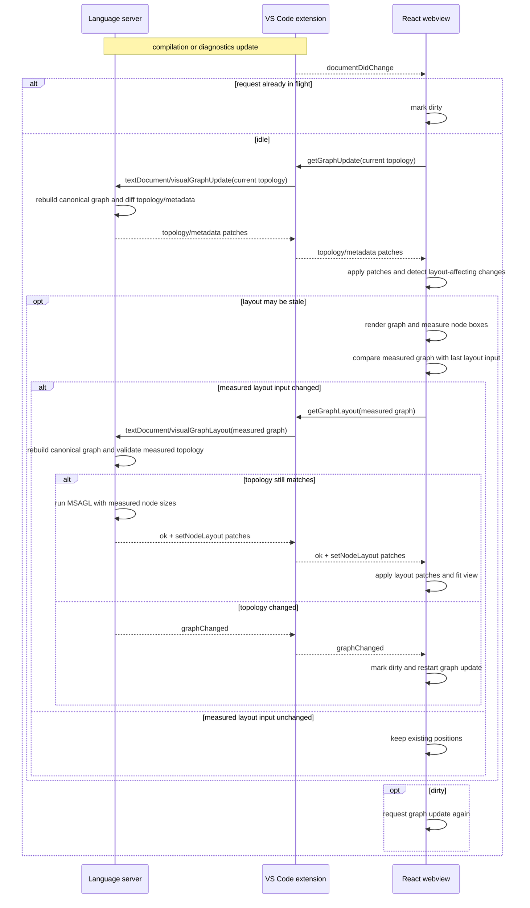
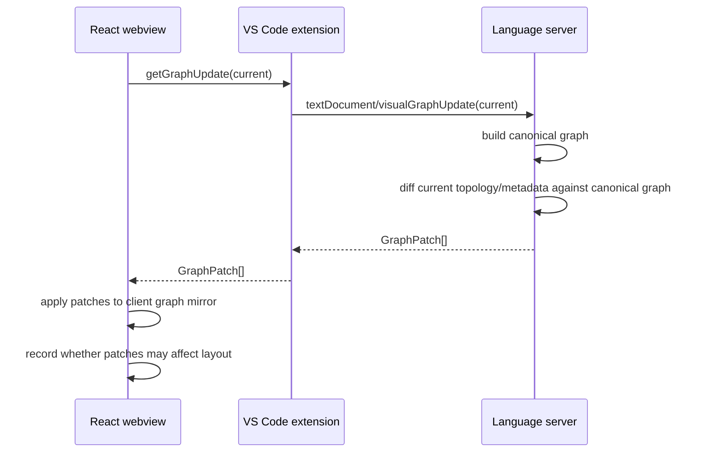
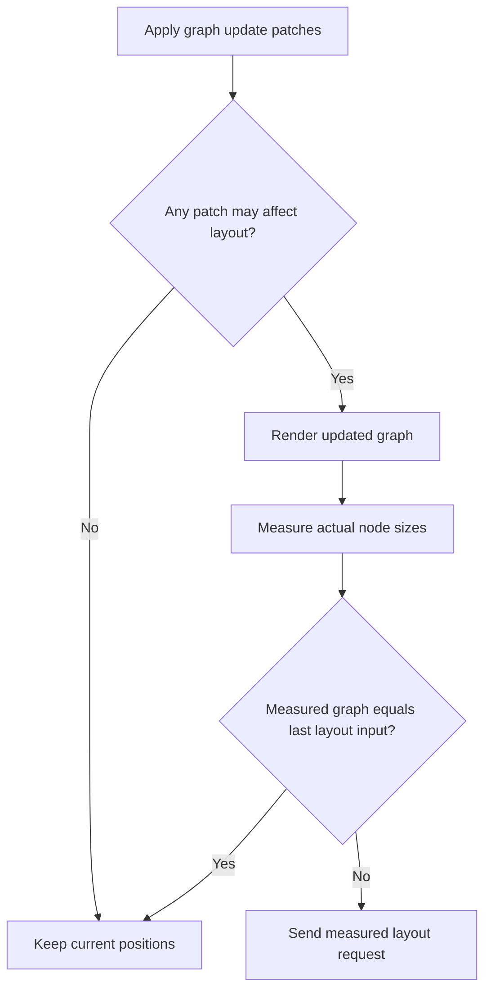
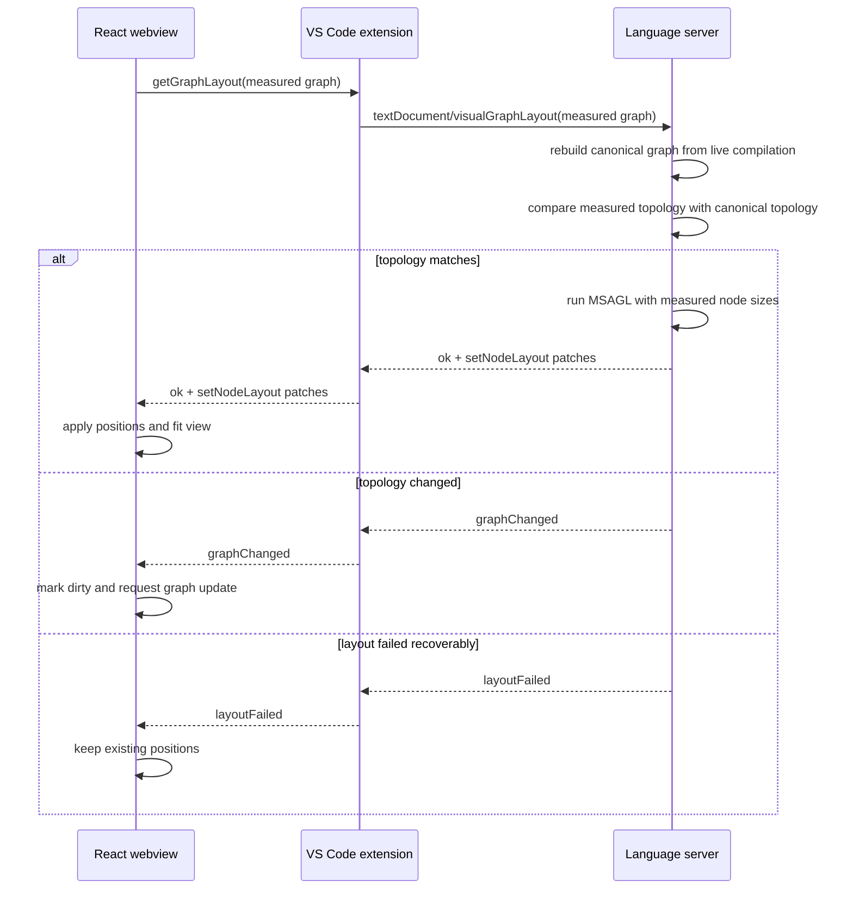
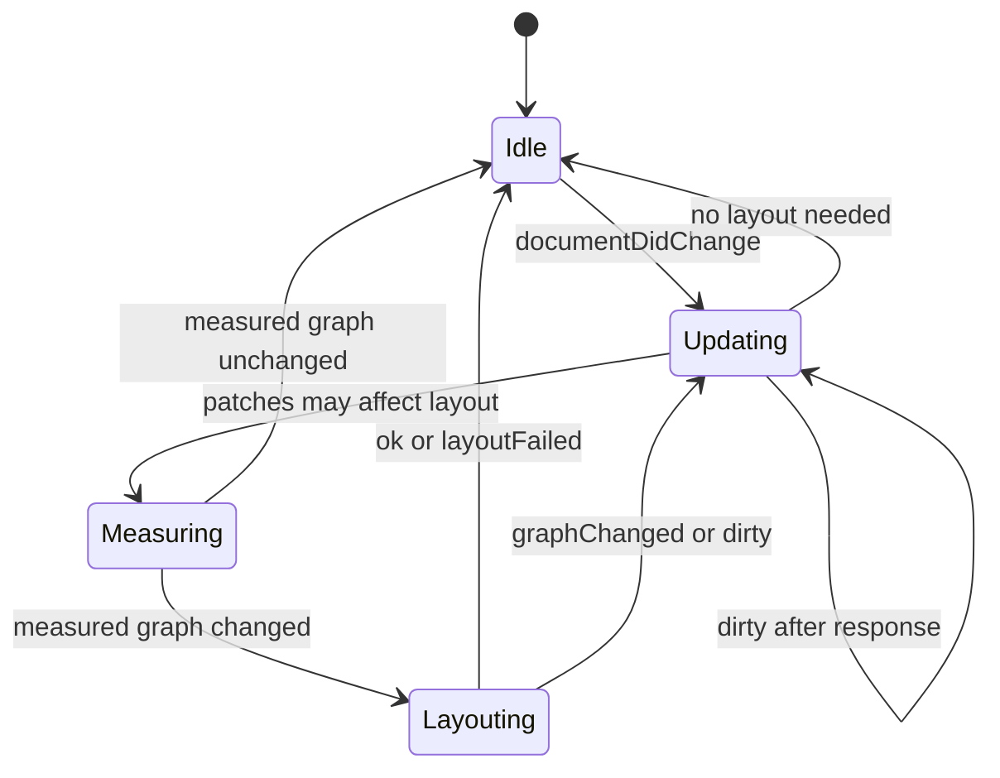

# Visual Graph Protocol

This document describes the server-driven visual graph protocol used by the Bicep visual designer.

The protocol is intentionally split into two phases:

1. Reconcile graph topology and metadata.
2. Render and measure nodes on the client, then request layout using actual node sizes.

This split exists because the language server cannot know the final rendered dimensions of React node cards before the webview renders them.

## Participants

- **Language server** builds the canonical graph from the live Bicep compilation, diffs topology and metadata, validates measured layout requests, and runs MSAGL.
- **VS Code extension host** forwards webview requests to language-server requests and forwards responses back. It does not compute topology or layout.
- **React webview** owns rendering, node measurement, pan/zoom, fit-view, and applying graph/layout patches.

## Message Flow



## Graph Update

The graph update request reconciles topology and metadata only. It does not run layout.

```ts
interface GetGraphUpdateRequest {
  current: RenderedGraph | null;
}

interface GetGraphUpdateResponse {
  patches: GraphPatch[];
}
```

The extension forwards this as:

```ts
interface VisualGraphUpdateParams {
  textDocument: { uri: string };
  current: RenderedGraph | null;
}

interface VisualGraphUpdateResult {
  patches: GraphPatch[];
}
```

### Update Sequence



## Client Layout Invalidation

The client decides whether layout may be stale while applying patches. This avoids making the server guess whether metadata changes affect rendered dimensions.

Layout-affecting patches:

- `clearGraph`
- `addNode`
- `removeNode`
- `addEdge`
- `removeEdge`
- `updateNode` when `type`, `isCollection`, or `hasChildren` changes

Non-layout-affecting patches:

- `updateNode` when only `hasError` changes
- `setErrorCount`
- `setNodeLayout`
- `setGraphBounds`

Notably, `hasError` does not trigger layout.

The server diffs node metadata per field and emits `updateNode` only when metadata actually changes. The client still compares each incoming field against the value it currently holds and treats the patch as layout-affecting only when a layout-relevant field (`type`, `isCollection`, or `hasChildren`) changed value. Source locations are resolved on demand and are not part of graph metadata, so whitespace-only edits do not produce node patches.

If a patch may affect layout, the client renders the updated graph, measures actual node boxes, builds a measured `RenderedGraph`, and compares it with the last measured graph that produced a layout. The client sends a layout request only when measured topology, sizes, or layout options changed.



## Measured Layout

The layout request is sent only after the graph has rendered and node dimensions have been measured.

```ts
interface GetGraphLayoutRequest {
  current: RenderedGraph;
}

interface GetGraphLayoutResponse {
  status: "ok" | "graphChanged" | "layoutFailed";
  patches: GraphPatch[];
}
```

The extension forwards this as:

```ts
interface VisualGraphLayoutParams {
  textDocument: { uri: string };
  current: RenderedGraph;
  options?: VisualGraphLayoutOptions;
}

interface VisualGraphLayoutResult {
  status: "ok" | "graphChanged" | "layoutFailed";
  patches: GraphPatch[];
}
```

Successful layout responses contain `setNodeLayout` patches and, when available, one `setGraphBounds` patch used for fit-view.

### Layout Sequence



## Rendered Graph

`RenderedGraph` carries topology plus measured node sizes. It intentionally does not send current positions back to the server.

```ts
interface RenderedGraph {
  nodes: RenderedGraphNode[];
  edges: RenderedGraphEdge[];
}

interface RenderedGraphNode {
  id: string;
  kind: "resource" | "module";
  parentId: string | null;
  type: string;
  isCollection: boolean;
  hasChildren: boolean;
  hasError: boolean;
  width: number;
  height: number;
}

interface RenderedGraphEdge {
  id: string;
  sourceId: string;
  targetId: string;
}
```

## Patch Shape

```ts
type GraphPatch =
  | { op: "clearGraph" }
  | { op: "addNode"; node: GraphNode }
  | { op: "removeNode"; nodeId: string }
  | { op: "updateNode"; nodeId: string; changes: GraphNodeChanges }
  | { op: "addEdge"; edge: GraphEdge }
  | { op: "removeEdge"; edgeId: string }
  | { op: "setNodeLayout"; nodeId: string; layout: NodeLayout }
  | { op: "setGraphBounds"; bounds: GraphBounds }
  | { op: "setErrorCount"; errorCount: number };
```

## Concurrency Rules

Each visualizer keeps one in-flight visual graph request at a time. A visual graph request is either a graph update request or a layout request.



If `documentDidChange` arrives while a request is in flight, the client sets a dirty flag. When the current request finishes, the client sends a fresh graph update if dirty is set.

The server remains stateless per request. It validates each measured layout request against the current live compilation instead of tracking graph revisions.
