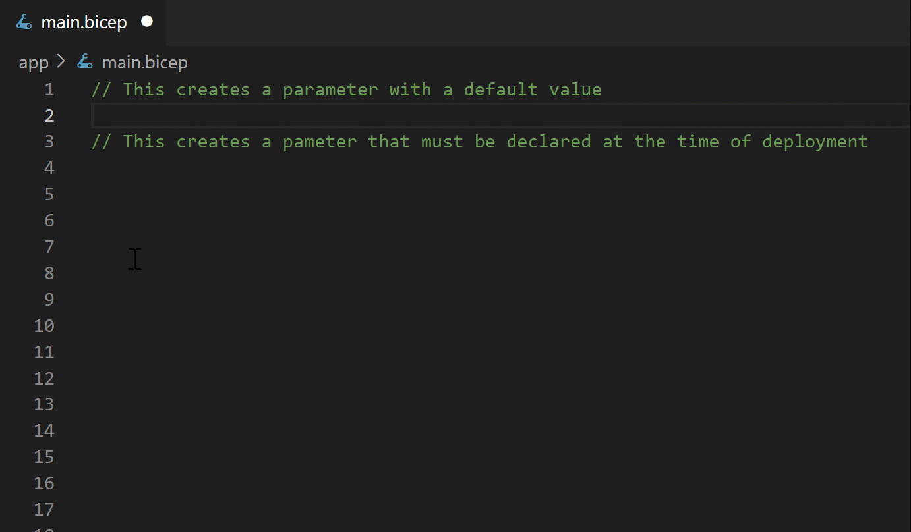

# Add parameters to your Bicep file

* First, create a parameter named location:
```bicep
param location string = resourceGroup().location
```
* Next, create a parameter named 'appPlanName':
```bicep
param appPlanName string = 'myAppPlanName'
```

These parameters will be used to fill in attributes in your resources.

<!--- See https://github.com/Microsoft/vscode/issues/69757 for details of how to pass arguments -->
[Copy code to clipboard](command:bicep.gettingStarted.copyToClipboard?%7B%22step%22%3A%22params%22%7D)


