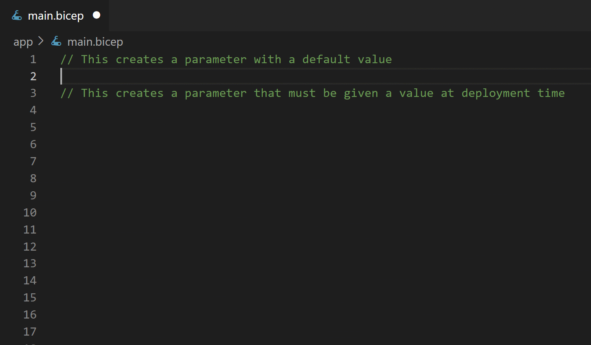

# Add parameters to your Bicep file

* First, create a parameter named location:
```bicep
param location string = resourceGroup().location
```
* Next, create a parameter named 'appPlanName':
```bicep
param appPlanName string
```

These parameters will be used to fill in attributes in your resources.

[Copy code to clipboard](command:bicep.gettingStarted.copyToClipboardParams)


