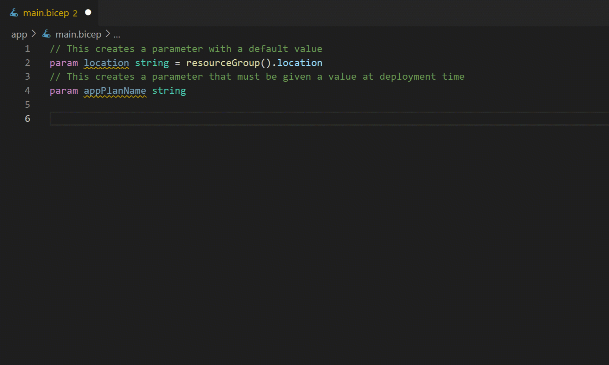

# Add resources to your Bicep file

* First, type `'appplan'` to view the 'App Service plan' resource snippet and press Tab or Enter. Press Tab to jump to the `name` attribute and replace its value with the parameter `appPlanName`.

* Next, type `'storage'` to view the 'Storage Account' resource snippet and press Tab or Enter. Replace the `name` attribute's value with `'${appServicePlan.name}storage'` (including the single quotes).

* Save the file.

Feel free to search for other snippets that suit your needs.

<!--- See https://github.com/Microsoft/vscode/issues/69757 for details of how to pass arguments -->
[Copy code to clipboard](command:bicep.gettingStarted.copyToClipboard?%7B%22step%22%3A%22resources%22%7D)

